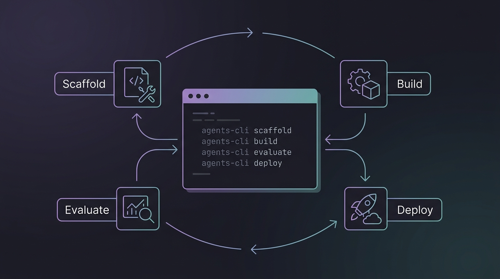
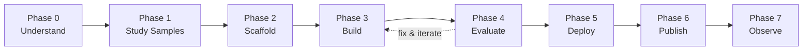

# Module 3 — ADK Agents with agents-cli



<div class="module-header" markdown>
**Duration:** ≈75 minutes  
**Goal:** Use `agents-cli` to scaffold, build, evaluate, and deploy a production-grade ADK agent — entirely from within your Antigravity CLI session.  
**Exercise:** [Exercise 10: ADK Agent — Scaffold, Eval, Deploy](exercises/ex10_agents_cli_lifecycle.md)
</div>

> 📖 Sources: [agents-cli GitHub](https://github.com/google/agents-cli) · [agents-cli Docs](https://google.github.io/agents-cli/) · [ADK](https://adk.dev) · [PyPI](https://pypi.org/project/google-agents-cli/)

---

## What is agents-cli?

`agents-cli` is **not** a coding agent. It's a **toolkit for coding agents** — it gives your Antigravity CLI session the skills and commands to build, evaluate, and deploy [ADK](https://adk.dev) (Agent Development Kit) agents on Google Cloud.

| | Antigravity CLI | agents-cli |
| :-- | :-- | :-- |
| **What it is** | Interactive coding agent | Toolkit *for* coding agents |
| **What it does** | Writes code, answers questions | Scaffolds, evaluates, deploys ADK agents |
| **How you use it** | Ask it to do things | Ask agy to use agents-cli to do things |
| **Works with** | — | Antigravity CLI, Gemini CLI, Claude Code, Codex |

Think of it this way: **agy is your hands, agents-cli is the power tools**.

---

## 3.1 — Setup <span class="duration-badge">10 min</span>

### Prerequisites

- Python 3.11+
- [uv](https://docs.astral.sh/uv/getting-started/installation/) (Python package manager)
- [Node.js](https://nodejs.org/) (for skill installation)
- A Google Cloud project or [AI Studio API key](https://aistudio.google.com/apikey)

### Install agents-cli

```bash
uvx google-agents-cli setup
```

This does three things:

1. Installs the `agents-cli` binary
2. Installs 7 skills into your coding agents (Antigravity CLI, Gemini CLI, Claude Code)
3. Configures authentication

### Verify

```bash
agents-cli info
```

!!! tip "Skills are the secret sauce"
    After setup, agy automatically loads agents-cli skills — meaning you can say *"scaffold an ADK agent"* and agy knows exactly what commands to run, what patterns to follow, and what mistakes to avoid.

---

## 3.2 — The 7-Phase Lifecycle <span class="duration-badge">10 min</span>

agents-cli enforces a **structured development lifecycle**. Each phase has a dedicated skill that your coding agent loads when it reaches that stage:



| Phase | Skill | What happens |
| :-- | :-- | :-- |
| 0 — Understand | — | Clarify goals, write `.agents-cli-spec.md` |
| 1 — Study Samples | — | Clone and study matching [adk-samples](https://github.com/google/adk-samples) |
| 2 — Scaffold | `google-agents-cli-scaffold` | `agents-cli scaffold create <name>` |
| 3 — Build | `google-agents-cli-adk-code` | Write agent code — tools, callbacks, state |
| 4 — Evaluate | `google-agents-cli-eval` | `agents-cli eval run` (runs + grades) → fix → `eval compare` → repeat |
| 5 — Deploy | `google-agents-cli-deploy` | `agents-cli deploy` to Agent Runtime / Cloud Run / GKE |
| 6 — Publish | `google-agents-cli-publish` | Register with Gemini Enterprise (optional) |
| 7 — Observe | `google-agents-cli-observability` | Cloud Trace, logging, monitoring |

> **Key insight:** Phase 4 (Evaluate) is the most critical. Expect **5–10+ iterations** of the eval-fix loop. This is normal and where agent quality comes from.

---

## 3.3 — Scaffolding a Project <span class="duration-badge">10 min</span>

### The Prototype-First Pattern

Always start with `--prototype` to skip CI/CD and Terraform. Get the agent working, then add deployment later:

```bash
# Step 1: Create a prototype
agents-cli scaffold create my-agent --agent adk --prototype

# Step 2: Iterate on agent code...

# Step 3: Add deployment when ready
agents-cli scaffold enhance . --deployment-target agent_runtime
```

### Template Options

| Template | Description |
| :-- | :-- |
| `adk` | Standard ADK agent (default) |
| `adk_a2a` | Agent-to-agent coordination (A2A protocol) |
| `agentic_rag` | RAG with data ingestion pipeline |

### Deployment Targets

| Target | Description |
| :-- | :-- |
| `agent_runtime` | Managed by Google (Gemini Enterprise Agent Runtime) |
| `cloud_run` | Container-based, more control |
| `gke` | Full Kubernetes control on GKE Autopilot |

### What the Scaffold Creates

```text
my-agent/
├── app/
│   ├── __init__.py          ← App entry point (name must match directory)
│   ├── agent.py             ← Agent definition (instruction, tools, model)
│   └── tools.py             ← Custom tool functions
├── tests/
│   └── eval/
│       ├── datasets/
│       │   └── basic-dataset.json  ← Starter eval cases
│       └── eval_config.yaml        ← Metrics configuration
├── .env                     ← Environment variables (project ID, API keys)
├── agents-cli-manifest.yaml ← Project metadata (CLI reads this)
├── pyproject.toml           ← Python dependencies
├── GEMINI.md                ← Coding agent guidance file
└── Makefile                 ← Common task shortcuts
```

---

## 3.4 — Building Agent Code <span class="duration-badge">15 min</span>

### Agent Definition Pattern

The scaffolded `app/agent.py` is your starting point:

```python
from google.adk import Agent

root_agent = Agent(
    name="my_agent",
    model="gemini-3.5-flash",
    instruction="""You are a helpful assistant that...""",
    tools=[my_tool_function],
)
```

### Tool Definition

Tools are plain Python functions with typed parameters and docstrings:

```python
def get_weather(city: str) -> dict:
    """Get current weather for a city.

    Args:
        city: The city name to look up weather for.

    Returns:
        A dict with temperature and conditions.
    """
    # Your implementation here
    return {"temp_f": 72, "conditions": "sunny"}
```

### Quick Testing

```bash
# One-off smoke test
agents-cli run "What's the weather in Tokyo?"

# Interactive playground (web UI)
agents-cli playground
```

!!! warning "Never write pytest tests that assert on LLM output"
    LLM outputs are non-deterministic. Use `agents-cli eval` for behavior validation, not pytest. Use pytest only for code correctness (imports work, functions return correct types).

---

## 3.5 — The Evaluation Loop <span class="duration-badge">20 min</span>

> **This is the most important section.** Evaluation is what separates a demo from a production agent.

### The Quality Flywheel

```text
┌─ 1. Prepare Data ─────── Write eval cases in tests/eval/evalsets/
│
├─ 2. Run + Grade ──────── agents-cli eval run --all
│
├─ 3. Analyze Failures ──── Read results, identify root causes
│
├─ 4. Fix & Iterate ────── Fix agent code, re-run eval run
│
└─ 5. Compare ──────────── agents-cli eval compare baseline.json candidate.json
```

### Eval Dataset Format

Eval cases are JSON files with prompts and optional expected behavior:

```json
{
  "eval_cases": [
    {
      "eval_case_id": "greeting",
      "prompt": {
        "role": "user",
        "parts": [{"text": "Hello, what can you help me with?"}]
      }
    },
    {
      "eval_case_id": "weather_query",
      "prompt": {
        "role": "user",
        "parts": [{"text": "What's the weather in San Francisco?"}]
      }
    }
  ]
}
```

### Built-in Metrics

| Metric | What it measures |
| :-- | :-- |
| `multi_turn_task_success` | Did the agent complete the user's goal? |
| `multi_turn_trajectory_quality` | Was the reasoning path logical and efficient? |
| `multi_turn_tool_use_quality` | Quality of tool/function calling |
| `final_response_quality` | Final response quality (no ground-truth needed) |
| `hallucination` | Factual grounding — catches fabricated claims |
| `safety` | Safety policy compliance |

### Running Evals

```bash
# Runs each eval case AND grades the traces (wraps adk eval)
agents-cli eval run --all

# Or target a single eval set
agents-cli eval run --evalset tests/eval/evalsets/basic-dataset.json

# Compare before/after a fix (positional: BASELINE CANDIDATE)
agents-cli eval compare baseline.json candidate.json
```

### When Scores Fail

| Failure | What to fix |
| :-- | :-- |
| `task_success` low | Orchestration, missing tool calls, premature termination |
| `trajectory_quality` low | Planning prompts, instruction order, redundant tool calls |
| `tool_use_quality` low | Tool descriptions, parameter docstrings, agent instructions |
| `hallucination` low | Tighten instructions to stay grounded in tool output |
| Agent calls wrong tools | Refine tool descriptions and agent instructions |

### Custom Metrics

When built-in metrics don't cover your domain, define custom ones in `eval_config.yaml`:

```yaml
metrics_to_run:
  - multi_turn_task_success
  - response_politeness    # custom metric below

custom_metrics:
  - name: response_politeness
    prompt_template: |
      Rate the agent's response 1-5 for professional politeness.
      Prompt: {prompt}
      Response: {response}
      Return JSON: {"score": <1|2|3|4|5>, "explanation": "<reason>"}
```

---

## 3.6 — Deployment <span class="duration-badge">10 min</span>

Once evals pass, add deployment and ship:

```bash
# Add deployment support (if prototype)
agents-cli scaffold enhance . --deployment-target agent_runtime

# Deploy
agents-cli deploy
```

### Adding CI/CD

```bash
# GitHub Actions
agents-cli scaffold enhance . --cicd-runner github_actions

# Google Cloud Build
agents-cli scaffold enhance . --cicd-runner google_cloud_build
```

### Deployment Targets Decision Matrix

| Need | Choose |
| :-- | :-- |
| Fastest path, managed infrastructure | `agent_runtime` |
| Custom container, full control | `cloud_run` |
| Kubernetes-native, team already on GKE | `gke` |

---

## 3.7 — Using agents-cli from Antigravity CLI <span class="duration-badge">5 min</span>

The real power is combining agy + agents-cli. In an Antigravity CLI session:

```text
> Use agents-cli to scaffold an ADK agent called "expense-tracker"
  that processes receipts and categorizes expenses.
  Start with a prototype.
```

agy will:

1. Load the `google-agents-cli-workflow` skill
2. Ask you clarifying questions (Phase 0)
3. Check for matching adk-samples (Phase 1)
4. Run `agents-cli scaffold create expense-tracker --agent adk --prototype`
5. Implement the agent code using ADK patterns (Phase 3)
6. Set up eval cases and run them (Phase 4)
7. Iterate until quality thresholds pass

You guide the high-level intent; agents-cli skills handle the implementation details.

---

## Skills Reference

The 7 skills installed by `agents-cli setup`:

| Skill | Slash command | What agy learns |
| :-- | :-- | :-- |
| `google-agents-cli-workflow` | `/google-agents-cli-workflow` | Full lifecycle, code preservation rules, model selection |
| `google-agents-cli-adk-code` | `/google-agents-cli-adk-code` | ADK Python API — agents, tools, orchestration, callbacks, state |
| `google-agents-cli-scaffold` | `/google-agents-cli-scaffold` | Project scaffolding — `create`, `enhance`, `upgrade` |
| `google-agents-cli-eval` | `/google-agents-cli-eval` | Eval methodology — metrics, datasets, LLM-as-judge |
| `google-agents-cli-deploy` | `/google-agents-cli-deploy` | Deployment — Agent Runtime, Cloud Run, GKE, CI/CD |
| `google-agents-cli-publish` | `/google-agents-cli-publish` | Gemini Enterprise registration |
| `google-agents-cli-observability` | `/google-agents-cli-observability` | Cloud Trace, logging, third-party integrations |

---

## Exercises

<div class="exercise-card" markdown>

### :material-file-document: Exercise 10: ADK Agent Lifecycle

**File:** [`ex10_agents_cli_lifecycle.md`](exercises/ex10_agents_cli_lifecycle.md)
**Duration:** 45 min
**Objective:** Scaffold, build, evaluate, and iterate on an ADK agent using the agents-cli workflow — from `scaffold create` through passing evals.

</div>

---

> **Next:** [Module 4 — Advanced: Building Agents with the Antigravity SDK](agy-sdk.md) — the capstone: build a production agent from scratch with the `google-antigravity` SDK.
