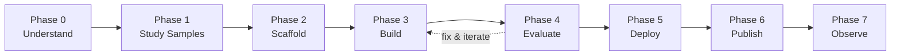

# Modul 5: Membangun Agen ADK dengan agents-cli

<div class="module-header" markdown>
**Durasi:** ~75 menit  
**Tujuan:** Menggunakan `agents-cli` untuk melakukan scaffold, membangun, mengevaluasi, dan men-deploy agen ADK tingkat produksi — sepenuhnya dari dalam sesi Antigravity CLI Anda.  
**Latihan:** [Latihan 12: Agen ADK — Scaffold, Evaluasi, Deploy](exercises/ex12_agents_cli_lifecycle.md)
</div>

> 📖 Sumber: [GitHub agents-cli](https://github.com/google/agents-cli) · [Dokumentasi agents-cli](https://google.github.io/agents-cli/) · [ADK](https://adk.dev) · [PyPI](https://pypi.org/project/google-agents-cli/)

---

## Apa itu agents-cli?

`agents-cli` **bukanlah** agen pengodean. Ini adalah **toolkit untuk agen pengodean** — ini memberikan sesi Antigravity CLI Anda skill dan perintah untuk membangun, mengevaluasi, dan men-deploy agen [ADK](https://adk.dev) (Agent Development Kit) di Google Cloud.

| | Antigravity CLI | agents-cli |
| :-- | :-- | :-- |
| **Apa itu** | Agen pengodean interaktif | Toolkit *untuk* agen pengodean |
| **Apa yang dilakukan** | Menulis kode, menjawab pertanyaan | Membuat perancah, mengevaluasi, men-deploy agen ADK |
| **Cara penggunaan** | Memintanya untuk melakukan sesuatu | Meminta agy untuk menggunakan agents-cli untuk melakukan sesuatu |
| **Bekerja dengan** | — | Antigravity CLI, Gemini CLI, Claude Code, Codex |

Anggap saja seperti ini: **agy adalah tangan Anda, agents-cli adalah perkakas mesinnya**.

---

## 5.1 — Pengaturan <span class="duration-badge">10 min</span>

### Prasyarat

- Python 3.11+
- [uv](https://docs.astral.sh/uv/getting-started/installation/) (manajer paket Python)
- [Node.js](https://nodejs.org/) (untuk instalasi skill)
- Proyek Google Cloud atau [kunci API AI Studio](https://aistudio.google.com/apikey)

### Instal agents-cli

```bash
uvx google-agents-cli setup
```

Ini melakukan tiga hal:

1. Menginstal berkas biner `agents-cli`
2. Menginstal 7 skill ke dalam agen pengodean Anda (Antigravity CLI, Gemini CLI, Claude Code)
3. Mengonfigurasi autentikasi

### Verifikasi

```bash
agents-cli info
```

!!! tip "Skill adalah bumbu rahasianya"
    Setelah pengaturan, agy secara otomatis memuat skill agents-cli — yang berarti Anda dapat mengatakan *"scaffold an ADK agent"* dan agy tahu persis perintah apa yang harus dijalankan, pola apa yang harus diikuti, dan kesalahan apa yang harus dihindari.

---

## 5.2 — Siklus Hidup 7 Fase <span class="duration-badge">10 menit</span>

agents-cli menerapkan **siklus hidup pengembangan yang terstruktur**. Setiap fase memiliki skill khusus yang dimuat oleh agen pengodean Anda saat mencapai tahap tersebut:



| Fase | Skill | Apa yang terjadi |
| :-- | :-- | :-- |
| 0 — Pahami | — | Perjelas tujuan, tulis `.agents-cli-spec.md` |
| 1 — Pelajari Sampel | — | Kloning dan pelajari [adk-samples](https://github.com/google/adk-samples) yang cocok |
| 2 — Scaffold | `google-agents-cli-scaffold` | `agents-cli scaffold create <name>` |
| 3 — Bangun | `google-agents-cli-adk-code` | Tulis kode agen — alat, callback, status |
| 4 — Evaluasi | `google-agents-cli-eval` | `agents-cli eval generate` → `eval grade` → perbaiki → ulangi |
| 5 — Deploy | `google-agents-cli-deploy` | `agents-cli deploy` ke Agent Runtime / Cloud Run / GKE |
| 6 — Publikasikan | `google-agents-cli-publish` | Daftarkan ke Gemini enterprise (opsional) |
| 7 — Observasi | `google-agents-cli-observability` | Cloud Trace, logging, pemantauan |

> **Wawasan utama:** Fase 4 (Evaluasi) adalah yang paling kritis. Perkirakan **5–10+ iterasi** dari loop evaluasi-perbaikan. Hal ini normal dan dari sinilah kualitas agen berasal.

---

## 5.3 — Membangun Kerangka Proyek <span class="duration-badge">10 min</span>

### Pola Mengutamakan Prototipe

Selalu mulai dengan `--prototype` untuk melewati CI/CD dan Terraform. Buat agen berfungsi terlebih dahulu, lalu tambahkan penerapan nanti:

```bash
# Step 1: Create a prototype
agents-cli scaffold create my-agent --agent adk --prototype

# Step 2: Iterate on agent code...

# Step 3: Add deployment when ready
agents-cli scaffold enhance . --deployment-target agent_runtime
```

### Opsi Templat

| Templat | Deskripsi |
| :-- | :-- |
| `adk` | Agen ADK standar (bawaan) |
| `adk_a2a` | Koordinasi antar-agen (protokol A2A) |
| `agentic_rag` | RAG dengan pipeline penyerapan data |

### Target Penerapan

| Target | Deskripsi |
| :-- | :-- |
| `agent_runtime` | Dikelola oleh Google (Runtime Agen Gemini enterprise) |
| `cloud_run` | Berbasis kontainer, lebih banyak kontrol |
| `gke` | Kontrol Kubernetes penuh pada GKE Autopilot |

### Apa yang Dibuat oleh Kerangka

```text
my-agent/
├── app/
│   ├── __init__.py          ← App entry point (name must match directory)
│   ├── agent.py             ← Agent definition (instruction, tools, model)
│   └── tools.py             ← Custom tool functions
├── tests/
│   └── eval/
│       ├── datasets/
│       │   └── basic-dataset.json  ← Starter eval cases
│       └── eval_config.yaml        ← Metrics configuration
├── .env                     ← Environment variables (project ID, API keys)
├── agents-cli-manifest.yaml ← Project metadata (CLI reads this)
├── pyproject.toml           ← Python dependencies
├── GEMINI.md                ← Coding agent guidance file
└── Makefile                 ← Common task shortcuts
```

---

## 5.4 — Membangun Kode Agen <span class="duration-badge">15 min</span>

### Pola Definisi Agen

`app/agent.py` yang telah di-scaffold adalah titik awal Anda:

```python
from google.adk import Agent

root_agent = Agent(
    name="my_agent",
    model="gemini-3.5-flash",
    instruction="""You are a helpful assistant that...""",
    tools=[my_tool_function],
)
```

### Definisi Alat

Alat adalah fungsi Python biasa dengan parameter bertipe dan docstring:

```python
def get_weather(city: str) -> dict:
    """Get current weather for a city.

    Args:
        city: The city name to look up weather for.

    Returns:
        A dict with temperature and conditions.
    """
    # Your implementation here
    return {"temp_f": 72, "conditions": "sunny"}
```

### Pengujian Cepat

```bash
# One-off smoke test
agents-cli run "What's the weather in Tokyo?"

# Interactive playground (web UI)
agents-cli playground
```

!!! warning "Jangan pernah menulis pengujian pytest yang melakukan asersi pada keluaran LLM"
    Keluaran LLM bersifat non-deterministik. Gunakan `agents-cli eval` untuk validasi perilaku, bukan pytest. Gunakan pytest hanya untuk kebenaran kode (impor berfungsi, fungsi mengembalikan tipe yang benar).

---

## 5.5 — Loop Evaluasi <span class="duration-badge">20 min</span>

> **Ini adalah bagian yang paling penting.** Evaluasi adalah apa yang membedakan sebuah demo dari agen produksi.

### Flywheel Kualitas

```text
┌─ 1. Prepare Data ─────── Write eval cases or synthesize them
│
├─ 2. Run Inference ────── agents-cli eval generate
│
├─ 3. Grade Traces ─────── agents-cli eval grade
│
├─ 4. Analyze Failures ──── Read results, identify root causes
│
└─ 5. Fix & Iterate ────── Fix agent code, go back to step 2
```

### Format Dataset Evaluasi

Kasus evaluasi adalah file JSON dengan prompt dan perilaku yang diharapkan opsional:

```json
{
  "eval_cases": [
    {
      "eval_case_id": "greeting",
      "prompt": {
        "role": "user",
        "parts": [{"text": "Hello, what can you help me with?"}]
      }
    },
    {
      "eval_case_id": "weather_query",
      "prompt": {
        "role": "user",
        "parts": [{"text": "What's the weather in San Francisco?"}]
      }
    }
  ]
}
```

### Metrik Bawaan

| Metrik | Apa yang diukur |
| :-- | :-- |
| `multi_turn_task_success` | Apakah agen menyelesaikan tujuan pengguna? |
| `multi_turn_trajectory_quality` | Apakah jalur penalaran logis dan efisien? |
| `multi_turn_tool_use_quality` | Kualitas pemanggilan alat/fungsi |
| `final_response_quality` | Kualitas respons akhir (tidak diperlukan ground-truth) |
| `hallucination` | Landasan faktual — menangkap klaim yang dibuat-buat |
| `safety` | Kepatuhan kebijakan keamanan |

### Menjalankan Evaluasi

```bash
# One command: generate traces + grade them
agents-cli eval run

# Or two-step for more control
agents-cli eval generate
agents-cli eval grade

# Compare before/after a fix
agents-cli eval compare baseline.json candidate.json
```

### Ketika Skor Gagal

| Kegagalan | Apa yang harus diperbaiki |
| :-- | :-- |
| `task_success` rendah | Orkestrasi, panggilan alat yang hilang, penghentian prematur |
| `trajectory_quality` rendah | Prompt perencanaan, urutan instruksi, panggilan alat yang berlebihan |
| `tool_use_quality` rendah | Deskripsi alat, docstring parameter, instruksi agen |
| `hallucination` rendah | Perketat instruksi agar tetap berlandaskan pada output alat |
| Agen memanggil alat yang salah | Perbaiki deskripsi alat dan instruksi agen |

### Metrik Kustom

Ketika metrik bawaan tidak mencakup domain Anda, tentukan metrik kustom di `eval_config.yaml`:

```yaml
metrics_to_run:
  - multi_turn_task_success
  - response_politeness    # custom metric below

custom_metrics:
  - name: response_politeness
    prompt_template: |
      Rate the agent's response 1-5 for professional politeness.
      Prompt: {prompt}
      Response: {response}
      Return JSON: {"score": <1|2|3|4|5>, "explanation": "<reason>"}
```

---

## 5.6 — Deployment <span class="duration-badge">10 min</span>

Setelah evaluasi berhasil, tambahkan deployment dan rilis:

```bash
# Add deployment support (if prototype)
agents-cli scaffold enhance . --deployment-target agent_runtime

# Deploy
agents-cli deploy
```

### Menambahkan CI/CD

```bash
# GitHub Actions
agents-cli scaffold enhance . --cicd-runner github_actions

# Google Cloud Build
agents-cli scaffold enhance . --cicd-runner google_cloud_build
```

### Matriks Keputusan Target Deployment

| Kebutuhan | Pilihan |
| :-- | :-- |
| Jalur tercepat, infrastruktur terkelola | `agent_runtime` |
| Kontainer kustom, kontrol penuh | `cloud_run` |
| Native Kubernetes, tim sudah menggunakan GKE | `gke` |

---

## 5.7 — Menggunakan agents-cli dari Antigravity CLI <span class="duration-badge">5 min</span>

Kekuatan sebenarnya adalah menggabungkan agy + agents-cli. Dalam sesi Antigravity CLI:

```text
> Use agents-cli to scaffold an ADK agent called "expense-tracker"
  that processes receipts and categorizes expenses.
  Start with a prototype.
```

agy akan:

1. Memuat skill `google-agents-cli-workflow`
2. Mengajukan pertanyaan klarifikasi kepada Anda (Fase 0)
3. Memeriksa kecocokan adk-samples (Fase 1)
4. Menjalankan `agents-cli scaffold create expense-tracker --agent adk --prototype`
5. Mengimplementasikan kode agen menggunakan pola ADK (Fase 3)
6. Menyiapkan kasus evaluasi dan menjalankannya (Fase 4)
7. Melakukan iterasi hingga ambang batas kualitas terpenuhi

Anda memandu niat tingkat tinggi; skill agents-cli menangani detail implementasi.

---

## Referensi Skill

7 skill yang diinstal oleh `agents-cli setup`:

| Skill | Perintah slash | Apa yang dipelajari agy |
| :-- | :-- | :-- |
| `google-agents-cli-workflow` | `/google-agents-cli-workflow` | Siklus hidup penuh, aturan pelestarian kode, pemilihan model |
| `google-agents-cli-adk-code` | `/google-agents-cli-adk-code` | API Python ADK — agen, alat, orkestrasi, callback, status |
| `google-agents-cli-scaffold` | `/google-agents-cli-scaffold` | Scaffolding proyek — `create`, `enhance`, `upgrade` |
| `google-agents-cli-eval` | `/google-agents-cli-eval` | Metodologi evaluasi — metrik, dataset, LLM-as-judge |
| `google-agents-cli-deploy` | `/google-agents-cli-deploy` | Deployment — Agent Runtime, Cloud Run, GKE, CI/CD |
| `google-agents-cli-publish` | `/google-agents-cli-publish` | Pendaftaran Gemini Enterprise |
| `google-agents-cli-observability` | `/google-agents-cli-observability` | Cloud Trace, logging, integrasi pihak ketiga |

---

## Latihan

<div class="exercise-card" markdown>

### :material-file-document: Latihan 12: Siklus Hidup Agen ADK

**Berkas:** [`ex12_agents_cli_lifecycle.md`](exercises/ex12_agents_cli_lifecycle.md)
**Durasi:** 45 menit
**Tujuan:** Melakukan scaffold, membangun, mengevaluasi, dan mengiterasi agen ADK menggunakan alur kerja agents-cli — dari `scaffold create` hingga lulus evaluasi.

</div>

---

> **Selanjutnya:** [Modul 4 — Multi-Agen & Lanjutan](multi-agent-advanced.md) untuk mengorkestrasi beberapa agen, pola sub-agen, dan sistem penjadwalan `/btw`.
