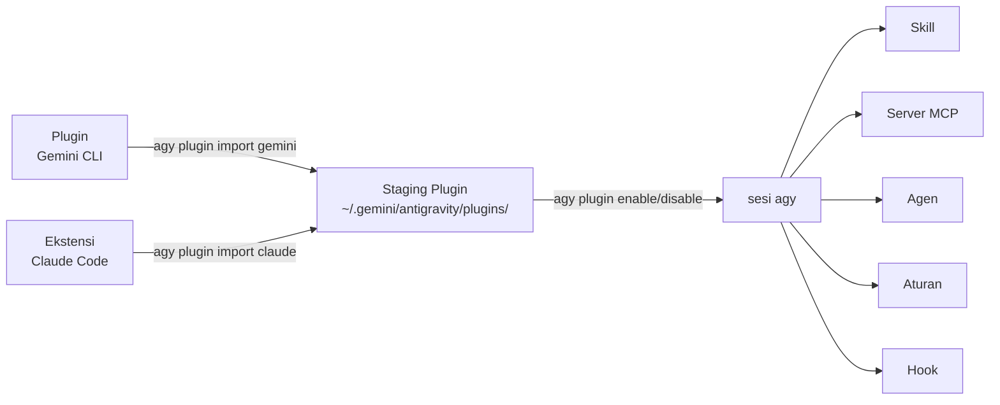

# Referensi: Ekosistem Plugin

> **Referensi mendalam untuk sistem plugin agy-cli.** Perintah-perintah penting dibahas dalam [Modul 1 — Bagian 1.7](sdlc-productivity.md#17-extend-with-plugins). Halaman ini memiliki detail siklus hidup lengkap untuk tim yang membangun dan memelihara plugin kustom.

---

## 2.0 — Mengapa Plugin Penting <span class="duration-badge">5 min</span>

Sistem plugin agy-cli melakukan sesuatu yang unik: sistem ini dapat **mengimpor plugin yang sudah Anda instal di Gemini CLI atau Claude Code** — tanpa perlu menginstal ulang atau mengonfigurasi ulang. Investasi Anda yang ada pada ekstensi akan terbawa.

```bash
# See what plugins are currently active in agy
agy plugin list
```

Outputnya adalah JSON yang menunjukkan nama, sumber, tanggal impor, dan komponen setiap plugin (skill, perintah, mcpServers, agen).

```bash
# More readable
agy plugin list | python3 -m json.tool
```

> 📖 Dokumentasi resmi: [Plugin](https://www.antigravity.google/docs/plugins) · [MCP](https://www.antigravity.google/docs/mcp) · [Skill](https://www.antigravity.google/docs/skills)

---

## 2.1 — Mengimpor dari Gemini CLI <span class="duration-badge">10 menit</span>

> **Pola: Jembatan Plugin Lintas Alat** — tarik seluruh pengaturan plugin Gemini CLI Anda ke dalam agy.

### Impor Semua Plugin Gemini CLI

```bash
agy plugin import gemini
```

agy memindai instalasi Gemini CLI lokal Anda, menemukan semua plugin yang terinstal, dan menyiapkan komponennya (skill, perintah, server MCP, agen) ke dalam konfigurasi agy di `~/.gemini/antigravity/`.

Outputnya terlihat seperti:

```text
  [ok]    code-review
          ✔ skills      : 3 processed
          ✔ commands    : 2 processed
          - mcpServers  : skipped (not found)
  [ok]    gemini-deep-research
          ✔ commands    : 1 processed
          ✔ mcpServers  : 1 processed
  [skip]  superpowers (already imported)
```

!!! tip "Impor ulang dengan --force"
    Plugin yang sudah diimpor akan dilewati secara default. Untuk memaksa impor ulang setelah pembaruan plugin:

    ```bash
    agy plugin import gemini --force
    ```

### What Gets Imported

| Component | What it means |
| :-- | :-- |
| `skills` | SKILL.md files with YAML frontmatter — injected into agy's context |
| `commands` | Slash commands available inside agy sessions |
| `mcpServers` | MCP tool servers (GitHub, gcloud, Workspace, etc.) — stdio or SSE |
| `agents` | Custom subagent definitions |
| `hooks` | Staged but not auto-executed (agy handles lifecycle differently) |
| `rules` | Rules files (`rules.md`, `rules/*.md`) injected as RULE blocks |

---

## 2.2 — Importing from Claude Code <span class="duration-badge">5 min</span>

> **Pattern: Unified Tool Surface** — if you use Claude Code alongside agy, import its plugins too.

```bash
agy plugin import claude
```

Same mechanic — agy discovers your Claude Code extension installations and bridges compatible components.

!!! info "Component compatibility"
    Not all Claude Code extension components map 1:1 to agy's model. agy imports what's compatible and silently skips what isn't.

---

## 2.3 — Managing Plugins Per-Project <span class="duration-badge">10 min</span>

> **Pattern: Project-Scoped Plugin Config** — not every plugin is appropriate for every codebase.

### Enable / Disable

```bash
# Menonaktifkan plugin untuk sesi/proyek ini
agy plugin disable gemini-deep-research

# Mengaktifkannya kembali
agy plugin enable gemini-deep-research

# Memeriksa status saat ini
agy plugin list
```

### Plugin Locations

Plugins can be installed at two levels:

| Scope | Path |
| :-- | :-- |
| **Global** | `~/.gemini/config/plugins/` |
| **Project** | `.agents/plugins/` |

### Install a Specific Plugin

```bash
# Menginstal berdasarkan nama (dari sumber yang dikonfigurasi)
agy plugin install <plugin-name>

# Menginstal versi tertentu
agy plugin install <plugin-name>@<version>
```

---

## 2.4 — Validating a Plugin <span class="duration-badge">10 min</span>

> **Pattern: Plugin-as-Code** — treat plugin definitions like source code. Validate before shipping.

### Validate an Existing Plugin Directory

```text
# Memvalidasi direktori plugin
agy plugin validate ./path/to/my-plugin

# Atau memvalidasi direktori saat ini
agy plugin validate .
```

This checks that the plugin's `plugin.json` manifest is well-formed and all referenced components exist.

### Build a Minimal Custom Plugin

A valid agy plugin needs a `plugin.json` manifest. Here's the official structure:

```text
my-plugin/
├── plugin.json          ← manifes (wajib)
├── mcp_config.json      ← definisi server MCP (opsional)
├── hooks.json           ← penangan peristiwa hook (opsional)
├── skills/              ← file SKILL.md dengan frontmatter YAML
│   └── my-skill/
│       └── SKILL.md
├── agents/              ← definisi sub-agen (opsional)
└── rules/               ← file aturan (opsional)
    └── my-rules.md
```

```json
{
  "name": "my-plugin",
  "version": "1.0.0",
  "description": "Plugin agy kustom saya",
  "components": ["skills"]
}
```

```bash
# Memvalidasinya
agy plugin validate ./my-plugin

# Jika valid, Anda akan melihat: ✔ Plugin manifest is valid
```

### Interacting with Plugin Components

Use slash commands to inspect active plugin components in a session:

| Command | What it shows |
| :-- | :-- |
| `/skills` | All loaded skills (from plugins, project, global) |
| `/mcp` | Active MCP servers and their status |

### Exercise: Validate the Workshop Plugin

The workshop repo includes a sample plugin at `samples/plugins/workshop-helpers/`. Validate it:

```bash
agy plugin validate samples/plugins/workshop-helpers/
```

---

## 2.5 — Plugin Architecture Overview



Plugin staging directory structure:

```bash
~/.gemini/antigravity/plugins/<name>/
├── plugin.json
├── mcp_config.json
├── hooks.json
├── skills/
├── agents/
└── rules/
```

---

## Latihan Modul 2

<div class="exercise-card" markdown>

### :material-file-document: Latihan 2: Jembatan Plugin

**Berkas:** `exercises/ex02_plugin_bridge.md`
**Durasi:** 20 menit
**Tujuan:** Mengimpor plugin dari Gemini CLI, mengaktifkan/menonaktifkan secara selektif, memvalidasi plugin kustom.

</div>

---

## Kembali ke Lokakarya

→ **[Modul 1: Produktivitas SDLC](sdlc-productivity.md)** — plugin diperkenalkan di Bagian 1.7

→ **[Lembar Contekan](cheatsheet.md)** — semua perintah plugin di satu tempat
