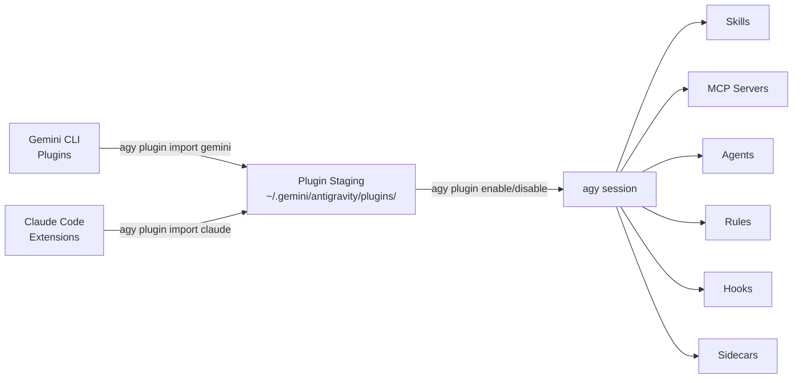

# Referensi: Ekosistem Plugin

> **Referensi mendalam untuk sistem plugin agy-cli.** Perintah-perintah penting dibahas dalam [Modul 1 — Bagian 1.7](sdlc-productivity.md#17-extend-with-plugins-15-min). Halaman ini berisi detail siklus hidup lengkap untuk tim yang membangun dan memelihara plugin kustom.

---

## 2.0 — Mengapa Plugin Penting <span class="duration-badge">5 menit</span>

Sistem plugin agy-cli melakukan sesuatu yang unik: sistem ini dapat **mengimpor plugin yang telah Anda instal di Gemini CLI atau Claude Code** — tanpa perlu menginstal ulang atau mengonfigurasi ulang. Investasi Anda yang sudah ada pada ekstensi akan terbawa.

```bash
# See what plugins are currently active in agy
agy plugin list
```

Outputnya adalah JSON yang menunjukkan nama, sumber, tanggal impor, dan komponen dari setiap plugin (skill, perintah, mcpServers, agen).

```bash
# More readable
agy plugin list | python3 -m json.tool
```

> 📖 Dokumentasi resmi: [Plugin](https://www.antigravity.google/docs/plugins) · [MCP](https://www.antigravity.google/docs/mcp) · [Skill](https://www.antigravity.google/docs/skills)

---

## 2.1 — Mengimpor dari Gemini CLI <span class="duration-badge">10 menit</span>

> **Pola: Cross-Tool Plugin Bridge** — tarik seluruh pengaturan plugin Gemini CLI Anda ke dalam agy.

### Impor Semua Plugin Gemini CLI

```bash
agy plugin import gemini
```

agy memindai instalasi Gemini CLI lokal Anda, menemukan semua plugin yang terinstal, dan menempatkan komponennya (skill, perintah, server MCP, agen) ke dalam konfigurasi agy di `~/.gemini/antigravity/`.

Outputnya terlihat seperti:

```text
  [ok]    code-review
          ✔ skills      : 3 processed
          ✔ commands    : 2 processed
          - mcpServers  : skipped (not found)
  [ok]    gemini-deep-research
          ✔ commands    : 1 processed
          ✔ mcpServers  : 1 processed
  [skip]  superpowers (already imported)
```

!!! tip "Impor ulang dengan --force"
    Plugin yang sudah diimpor akan dilewati secara default. Untuk memaksa impor ulang setelah pembaruan plugin:
    ```bash
    agy plugin import gemini --force
    ```

### What Gets Imported

| Component | What it means |
| :-- | :-- |
| `skills` | SKILL.md files with YAML frontmatter — injected into agy's context |
| `commands` | Slash commands available inside agy sessions |
| `mcpServers` | MCP tool servers (GitHub, gcloud, Workspace, etc.) — stdio or SSE |
| `agents` | Custom subagent definitions |
| `hooks` | Staged but not auto-executed (agy handles lifecycle differently) |
| `rules` | Rules files (`rules.md`, `rules/*.md`) injected as RULE blocks |

---

## 2.2 — Importing from Claude Code <span class="duration-badge">5 min</span>

> **Pattern: Unified Tool Surface** — if you use Claude Code alongside agy, import its plugins too.

```bash
agy plugin import claude
```

Same mechanic — agy discovers your Claude Code extension installations and bridges compatible components.

!!! info "Component compatibility"
    Not all Claude Code extension components map 1:1 to agy's model. agy imports what's compatible and silently skips what isn't.

---

## 2.3 — Managing Plugins Per-Project <span class="duration-badge">10 min</span>

> **Pattern: Project-Scoped Plugin Config** — not every plugin is appropriate for every codebase.

### Enable / Disable

```bash
# Disable a plugin for this session/project
agy plugin disable gemini-deep-research

# Re-enable it
agy plugin enable gemini-deep-research

# Check current state
agy plugin list
```

### Plugin Locations

Plugins can be installed at two levels:

| Scope | Path |
| :-- | :-- |
| **Global** | `~/.gemini/config/plugins/` |
| **Project** | `.agents/plugins/` |

### Install a Specific Plugin

```bash
# Install by name (from configured source)
agy plugin install <plugin-name>

# Install a specific version
agy plugin install <plugin-name>@<version>
```

---

## 2.4 — Validating a Plugin <span class="duration-badge">10 min</span>

> **Pattern: Plugin-as-Code** — treat plugin definitions like source code. Validate before shipping.

### Validate an Existing Plugin Directory

```bash
# Validate a plugin directory
agy plugin validate ./path/to/my-plugin

# Or validate the current directory
agy plugin validate .
```

This checks that the plugin's `plugin.json` manifest is well-formed and all referenced components exist.

### Build a Minimal Custom Plugin

A valid agy plugin needs a `plugin.json` manifest. Here's the official structure:

```text
my-plugin/
├── plugin.json          ← manifest (required)
├── mcp_config.json      ← MCP server definitions (optional)
├── hooks.json           ← hook event handlers (optional)
├── skills/              ← SKILL.md files with YAML frontmatter
│   └── my-skill/
│       └── SKILL.md
├── agents/              ← subagent definitions (optional)
└── rules/               ← rules files (optional)
    └── my-rules.md
```

```json
{
  "name": "my-plugin",
  "version": "1.0.0",
  "description": "My custom agy plugin",
  "components": ["skills"]
}
```

```bash
# Validate it
agy plugin validate ./my-plugin

# If valid, you'll see: ✔ Plugin manifest is valid
```

### Interacting with Plugin Components

Use slash commands to inspect active plugin components in a session:

| Command | What it shows |
| :-- | :-- |
| `/skills` | All loaded skills (from plugins, project, global) |
| `/mcp` | Active MCP servers and their status |

### Exercise: Validate the Workshop Plugin

The workshop repo includes a sample plugin at `samples/plugins/workshop-helpers/`. Validate it:

```bash
agy plugin validate samples/plugins/workshop-helpers/
```

---

## 2.5 — Plugin Architecture Overview



Plugin staging directory structure:

```text
~/.gemini/antigravity/plugins/<name>/
├── plugin.json
├── mcp_config.json
├── hooks.json
├── skills/
├── agents/
├── rules/
└── sidecars/          ← plugin-scoped background processes
```

---

## 2.6 — Sidecars: Persistent Background Processes <span class="duration-badge">15 min</span>

> **Pattern: Always-On Agent** — sidecars run alongside AGY CLI, independently of any conversation. Use them for scheduled tasks, event watchers, and persistent background workers.
>
> 📖 Source: [sidecars](https://antigravity.google/docs/sidecars)

### What Sidecars Are

A sidecar is a background process that AGY manages for you: it launches automatically when AGY starts, restarts on crash, and runs independently of your active conversation. Unlike hooks (which fire in response to conversation events), sidecars are **always running**.

**Three use cases:**

| Use case | Example |
| :-- | :-- |
| Persistent background worker | Python script that watches a queue |
| Scheduled recurring task | Hourly PR triage via `schedule` builtin |
| Event-reactive agent | `agentapi` call that spins up a new conversation |

### Configuration

Sidecars are discovered from two locations:

```bash
# Global sidecars (available in all projects)
~/.gemini/config/sidecars/<sidecar-name>/sidecar.json

# Plugin-scoped sidecars (shipped with a plugin)
~/.gemini/config/plugins/<plugin-name>/sidecars/<sidecar-name>/sidecar.json
```

The directory name becomes the sidecar's ID. Plugin sidecars get the ID `<pluginName>/<sidecarName>`.

**Sidecars are disabled by default.** Enable them explicitly in `~/.gemini/config/config.json`:

```json
{
  "sidecars": {
    "pr-triage": {
      "enabled": true
    },
    "my-plugin/log-watcher": {
      "enabled": true,
      "projectId": "<conversation-project-id>"
    }
  }
}
```

### sidecar.json Schema

| Field | Type | Description |
| :-- | :-- | :-- |
| `command` | string | Executable to run (e.g. `python3`). Mutually exclusive with `builtin`. |
| `builtin` | string | Built-in function. Currently only `schedule`. Mutually exclusive with `command`. |
| `args` | string[] | Arguments passed to the command or builtin. |
| `restart_policy` | string | `always` (default), `on-failure`, or `never`. |
| `description` | string | Human-readable label shown in AGY UI. |
| `env` | object | Environment variables for the sidecar process. |
| `display_name` | string | Display name in the UI. |

### Example 1: Background Worker Script

```json
{
  "description": "Watches the build queue and notifies on failures",
  "command": "python3",
  "args": ["watch_builds.py"],
  "restart_policy": "on-failure",
  "env": {
    "BUILD_QUEUE_URL": "https://ci.example.com/api/queue"
  }
}
```

### Example 2: Scheduled Recurring Task (the `schedule` builtin)

The `schedule` builtin takes a cron expression as its first arg, then the command + args to run:

```json
{
  "description": "Hourly PR triage — summarises incoming review requests",
  "builtin": "schedule",
  "args": [
    "0 * * * *",
    "agentapi",
    "new-conversation",
    "Summarise all open PRs waiting for my review. Group by urgency."
  ]
}
```

`agentapi` is automatically available to sidecars — it lets them **programmatically create or message conversations**:

```bash
# Start a new conversation from a sidecar
agentapi new-conversation "<prompt>"

# Send a message to an existing conversation
agentapi send-message <conversation_id> "<prompt>"
```

!!! warning "projectId required for agentapi"
    Sidecars that use `agentapi new-conversation` must have a `projectId` set in `config.json` — this scopes which conversation project the new session is created under.

### Runtime Data

Sidecar output is stored at:

```text
~/.gemini/antigravity/sidecar_data/<sidecarId>/
├── data/     ← persistent storage (ANTIGRAVITY_EXECUTABLE_DATA_DIR env var)
├── logs/     ← timestamped stdout/stderr logs
└── events/   ← JSON records of agentapi calls
```

### Directory Structure for a Plugin Sidecar

```text
~/.gemini/config/plugins/my-plugin/
└── sidecars/
    └── pr-triage/
        ├── sidecar.json   ← config (required)
        └── triage.py      ← helper script (optional, runs in this dir)
```

---

## Latihan Modul 2

<div class="exercise-card" markdown>

### :material-file-document: Latihan 2: Jembatan Plugin

**Berkas:** [`ex02_plugin_bridge.md`](exercises/ex02_plugin_bridge.md)
**Durasi:** 20 menit
**Tujuan:** Mengimpor plugin dari Gemini CLI, mengaktifkan/menonaktifkan secara selektif, memvalidasi plugin kustom.

</div>

<div class="exercise-card" markdown>

### :material-clock-outline: Latihan 2B: Sidecar Pertama Anda

**Berkas:** [`ex02b_first_sidecar.md`](exercises/ex02b_first_sidecar.md)

> **Durasi:** 20 menit
> **Bangun:** Sebuah **sidecar standup harian** terjadwal yang berjalan pada pukul 9 pagi, membuat percakapan AGY baru, dan memintanya untuk merangkum commit git kemarin di seluruh repositori Anda.

**Apa yang akan Anda lakukan:**

1. Buat `~/.gemini/config/sidecars/standup/sidecar.json` menggunakan bawaan `schedule`
2. Atur cron ke `0 9 * * 1-5` (9 pagi Senin–Jumat)
3. Gunakan `agentapi new-conversation` untuk membuka percakapan dengan prompt standup Anda
4. Aktifkan di `~/.gemini/config/config.json`
5. Verifikasi bahwa itu muncul di log pada `~/.gemini/antigravity/sidecar_data/standup/logs/`

**Tujuan tambahan:** Tambahkan sidecar kedua menggunakan `command: python3` yang memantau perubahan pada berkas lokal dan mengirimkan pesan ke percakapan yang ada ketika mendeteksi adanya diff.

</div>

---

## Kembali ke Workshop

→ **[Modul 1: Produktivitas SDLC](sdlc-productivity.md)** — plugin diperkenalkan pada Bagian 1.7

→ **[Lembar Contekan](cheatsheet.md)** — semua perintah plugin dan sidecar di satu tempat
