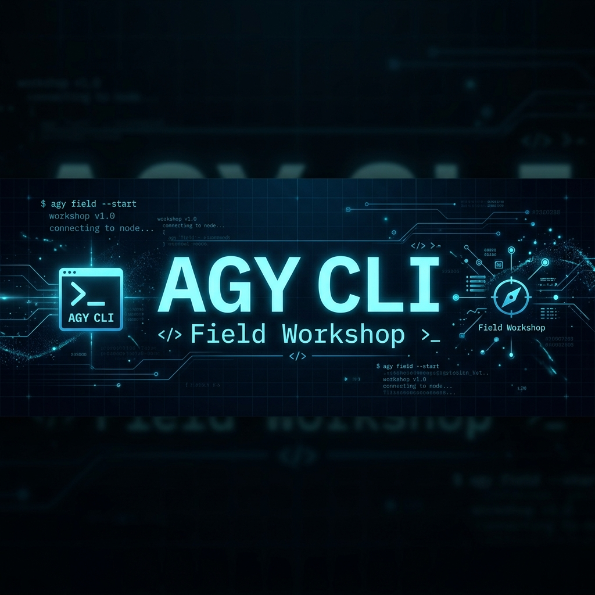

  

---

## Workshop Modules

- :material-rocket-launch:{ .lg .middle } **Module 1 — Antigravity CLI Fundamentals**

    ---

    Your first Antigravity CLI session, the **Artifacts** plan-review-verify workflow, custom skills & rules, connecting tools via **MCP**, and safe sandbox governance.

    **90 min** · Exercises: ex01, ex15, ex02, ex16, ex09

    [:octicons-arrow-right-24: Start Module 1](sdlc-productivity.md)

- :material-wrench:{ .lg .middle } **Module 2 — Legacy Modernization & Advanced CLI ⭐**

    ---

    The flagship module. Migrate a real legacy **Java** codebase with strict mode and agent self-onboarding (an optional **.NET** path is included) — then layer in the advanced CLI: subagents, `/btw` mid-task steering, and headless `--print` automation.

    **120 min** · Exercises: ex04, ex13, ex07, ex08, ex12 · *ex03 (.NET) optional — needs Docker*

    [:octicons-arrow-right-24: Start Module 2](legacy-modernization.md)

- :material-rocket-launch-outline:{ .lg .middle } **Module 3 — ADK Agents with agents-cli**

    ---

    Use agents-cli to scaffold, build, evaluate, and deploy production ADK agents — the full lifecycle from prototype to Cloud Run, plus an optional GCP Data Cloud lab.

    **75 min** · Exercises: ex10, ex14 (optional)

    [:octicons-arrow-right-24: Start Module 3](agents-cli.md)

- :material-code-braces:{ .lg .middle } **Module 4 — Advanced: Building Agents with the Antigravity SDK**

    ---

    The advanced capstone. Build agents in Python with the Antigravity SDK — tools, hooks, triggers, multi-agent orchestration, and deploy to Cloud Run.

    **90 min** · Exercises: ex05, ex06, ex11

    [:octicons-arrow-right-24: Start Module 4](agy-sdk.md)

---

## Workshop Timeline

| Time | Content | Duration |
| :-- | :-- | :-- |
| `0:00` | Setup + first run | 20 min |
| `0:20` | **Module 1:** Antigravity CLI Fundamentals | 90 min |
| `1:50` | :coffee: Break | 10 min |
| `2:00` | **Module 2:** Legacy Modernization & Advanced CLI | 120 min |
| `4:00` | :coffee: Break | 10 min |
| `4:10` | **Module 3:** ADK Agents with agents-cli | 75 min |
| `5:25` | :coffee: Break | 10 min |
| `5:35` | **Module 4:** Advanced — Antigravity SDK | 90 min |
| `7:05` | Wrap-up & Q&A | 15 min |

> **Full day:** Modules 1–3 (~5.5 hrs). **Extended:** All 4 modules (7 hrs). **Half-day:** Modules 1 + 2 (3.5 hrs). **Lightning:** Module 1 (1.5 hrs).

---

## Before You Start

!!! warning "Pre-Work Required"
    Complete the [Environment Setup](setup.md) before the workshop. You need Antigravity CLI installed and authenticated.

!!! info "Official Documentation"
    Full reference at [antigravity.google/docs](https://www.antigravity.google/docs/cli-overview).

!!! info "Prerequisite"
    Familiarity with a terminal, Git, and basic coding workflows. No prior AI coding assistant experience required.
