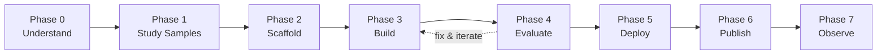

# 모듈 5: agents-cli를 사용하여 ADK 에이전트 구축하기

<div class="module-header" markdown>
**소요 시간:** 약 75분  
**목표:** Antigravity CLI 세션 내에서 전적으로 `agents-cli`를 사용하여 프로덕션 수준의 ADK 에이전트를 스캐폴딩, 빌드, 평가 및 배포합니다.  
**실습:** [실습 12: ADK 에이전트 — 스캐폴딩, 평가, 배포](exercises/ex12_agents_cli_lifecycle.md)
</div>

> 📖 출처: [agents-cli GitHub](https://github.com/google/agents-cli) · [agents-cli 문서](https://google.github.io/agents-cli/) · [ADK](https://adk.dev) · [PyPI](https://pypi.org/project/google-agents-cli/)

---

## agents-cli란 무엇인가요?

`agents-cli`는 코딩 에이전트가 **아닙니다**. 이것은 **코딩 에이전트를 위한 툴킷**입니다. Antigravity CLI 세션에 Google Cloud에서 [ADK](https://adk.dev) (Agent Development Kit) 에이전트를 빌드, 평가 및 배포할 수 있는 스킬과 명령어를 제공합니다.

| | Antigravity CLI | agents-cli |
| :-- | :-- | :-- |
| **무엇인가** | 대화형 코딩 에이전트 | 코딩 에이전트를 *위한* 툴킷 |
| **하는 일** | 코드 작성, 질문 답변 | ADK 에이전트 스캐폴딩, 평가, 배포 |
| **사용 방법** | 작업 수행을 요청함 | agy에게 agents-cli를 사용하여 작업을 수행하도록 요청함 |
| **호환 대상** | — | Antigravity CLI, Gemini CLI, Claude Code, Codex |

이렇게 생각해 보세요. **agy가 여러분의 손이라면, agents-cli는 전동 공구입니다**.

---

## 5.1 — 설정 <span class="duration-badge">10분</span>

### 사전 요구 사항

- Python 3.11+
- [uv](https://docs.astral.sh/uv/getting-started/installation/) (Python 패키지 관리자)
- [Node.js](https://nodejs.org/) (스킬 설치용)
- Google Cloud 프로젝트 또는 [AI Studio API 키](https://aistudio.google.com/apikey)

### agents-cli 설치

```bash
uvx google-agents-cli setup
```

이 작업은 다음 세 가지를 수행합니다:

1. `agents-cli` 바이너리 설치
2. 코딩 에이전트(Antigravity CLI, Gemini CLI, Claude Code)에 7개의 스킬 설치
3. 인증 구성

### 확인

```bash
agents-cli info
```

!!! tip "스킬이 핵심 비결입니다"
    설정 후 agy는 자동으로 agents-cli 스킬을 로드합니다. 즉, *"ADK 에이전트 스캐폴딩해 줘"*라고 말하면 agy가 실행할 명령, 따라야 할 패턴, 피해야 할 실수를 정확히 알 수 있습니다.

---

## 5.2 — 7단계 수명 주기 <span class="duration-badge">10분</span>

agents-cli는 **구조화된 개발 수명 주기**를 강제합니다. 각 단계에는 코딩 에이전트가 해당 단계에 도달했을 때 로드하는 전용 스킬이 있습니다:



| 단계 | 스킬 | 수행 내용 |
| :-- | :-- | :-- |
| 0 — 이해 | — | 목표 명확화, `.agents-cli-spec.md` 작성 |
| 1 — 샘플 학습 | — | 일치하는 [adk-samples](https://github.com/google/adk-samples) 클론 및 학습 |
| 2 — 스캐폴드 | `google-agents-cli-scaffold` | `agents-cli scaffold create <name>` |
| 3 — 빌드 | `google-agents-cli-adk-code` | 에이전트 코드 작성 — 도구, 콜백, 상태 |
| 4 — 평가 | `google-agents-cli-eval` | `agents-cli eval generate` → `eval grade` → 수정 → 반복 |
| 5 — 배포 | `google-agents-cli-deploy` | Agent Runtime / Cloud Run / GKE에 `agents-cli deploy` |
| 6 — 게시 | `google-agents-cli-publish` | Gemini 엔터프라이즈에 등록 (선택 사항) |
| 7 — 관찰 | `google-agents-cli-observability` | Cloud Trace, 로깅, 모니터링 |

> **핵심 인사이트:** 4단계(평가)가 가장 중요합니다. 평가-수정 루프를 **5~10회 이상 반복**할 것으로 예상하십시오. 이는 정상적인 과정이며 에이전트의 품질은 여기서 비롯됩니다.

---

## 5.3 — 프로젝트 스캐폴딩 <span class="duration-badge">10 min</span>

### 프로토타입 우선 패턴

항상 `--prototype`으로 시작하여 CI/CD 및 Terraform을 건너뛰세요. 에이전트가 작동하도록 한 다음, 나중에 배포를 추가하세요:

```bash
# Step 1: Create a prototype
agents-cli scaffold create my-agent --agent adk --prototype

# Step 2: Iterate on agent code...

# Step 3: Add deployment when ready
agents-cli scaffold enhance . --deployment-target agent_runtime
```

### 템플릿 옵션

| 템플릿 | 설명 |
| :-- | :-- |
| `adk` | 표준 ADK 에이전트 (기본값) |
| `adk_a2a` | 에이전트 간 조정 (A2A 프로토콜) |
| `agentic_rag` | 데이터 수집 파이프라인이 있는 RAG |

### 배포 대상

| 대상 | 설명 |
| :-- | :-- |
| `agent_runtime` | Google에서 관리 (Gemini Enterprise Agent Runtime) |
| `cloud_run` | 컨테이너 기반, 더 많은 제어 가능 |
| `gke` | GKE Autopilot에서 전체 Kubernetes 제어 |

### 스캐폴드가 생성하는 것

```text
my-agent/
├── app/
│   ├── __init__.py          ← App entry point (name must match directory)
│   ├── agent.py             ← Agent definition (instruction, tools, model)
│   └── tools.py             ← Custom tool functions
├── tests/
│   └── eval/
│       ├── datasets/
│       │   └── basic-dataset.json  ← Starter eval cases
│       └── eval_config.yaml        ← Metrics configuration
├── .env                     ← Environment variables (project ID, API keys)
├── agents-cli-manifest.yaml ← Project metadata (CLI reads this)
├── pyproject.toml           ← Python dependencies
├── GEMINI.md                ← Coding agent guidance file
└── Makefile                 ← Common task shortcuts
```

---

## 5.4 — 에이전트 코드 빌드 <span class="duration-badge">15분</span>

### 에이전트 정의 패턴

스캐폴딩된 `app/agent.py`가 시작점입니다:

```python
from google.adk import Agent

root_agent = Agent(
    name="my_agent",
    model="gemini-3.5-flash",
    instruction="""You are a helpful assistant that...""",
    tools=[my_tool_function],
)
```

### 도구 정의

도구는 타입이 지정된 매개변수와 독스트링(docstring)이 있는 일반 Python 함수입니다:

```python
def get_weather(city: str) -> dict:
    """Get current weather for a city.

    Args:
        city: The city name to look up weather for.

    Returns:
        A dict with temperature and conditions.
    """
    # Your implementation here
    return {"temp_f": 72, "conditions": "sunny"}
```

### 빠른 테스트

```bash
# One-off smoke test
agents-cli run "What's the weather in Tokyo?"

# Interactive playground (web UI)
agents-cli playground
```

!!! warning "LLM 출력을 단언(assert)하는 pytest 테스트를 절대 작성하지 마세요"
    LLM 출력은 비결정적입니다. 동작 검증에는 pytest가 아닌 `agents-cli eval`을 사용하세요. pytest는 코드의 정확성(import 작동 여부, 함수가 올바른 타입을 반환하는지 여부)을 확인하는 데만 사용하세요.

---

## 5.5 — 평가 루프 <span class="duration-badge">20분</span>

> **이것은 가장 중요한 섹션입니다.** 평가는 데모와 프로덕션 에이전트를 구분하는 기준입니다.

### 품질 플라이휠

```text
┌─ 1. Prepare Data ─────── Write eval cases or synthesize them
│
├─ 2. Run Inference ────── agents-cli eval generate
│
├─ 3. Grade Traces ─────── agents-cli eval grade
│
├─ 4. Analyze Failures ──── Read results, identify root causes
│
└─ 5. Fix & Iterate ────── Fix agent code, go back to step 2
```

### 평가 데이터셋 형식

평가 케이스는 프롬프트와 선택적인 예상 동작이 포함된 JSON 파일입니다:

```json
{
  "eval_cases": [
    {
      "eval_case_id": "greeting",
      "prompt": {
        "role": "user",
        "parts": [{"text": "Hello, what can you help me with?"}]
      }
    },
    {
      "eval_case_id": "weather_query",
      "prompt": {
        "role": "user",
        "parts": [{"text": "What's the weather in San Francisco?"}]
      }
    }
  ]
}
```

### 내장 메트릭

| 메트릭 | 측정 내용 |
| :-- | :-- |
| `multi_turn_task_success` | 에이전트가 사용자의 목표를 완료했는가? |
| `multi_turn_trajectory_quality` | 추론 경로가 논리적이고 효율적이었는가? |
| `multi_turn_tool_use_quality` | 도구/함수 호출의 품질 |
| `final_response_quality` | 최종 응답 품질 (정답(ground-truth) 불필요) |
| `hallucination` | 사실적 근거 — 조작된 주장을 포착함 |
| `safety` | 안전 정책 준수 여부 |

### 평가 실행

```bash
# One command: generate traces + grade them
agents-cli eval run

# Or two-step for more control
agents-cli eval generate
agents-cli eval grade

# Compare before/after a fix
agents-cli eval compare baseline.json candidate.json
```

### 점수가 낮을 때

| 실패 유형 | 수정할 내용 |
| :-- | :-- |
| `task_success` 낮음 | 오케스트레이션, 누락된 도구 호출, 조기 종료 |
| `trajectory_quality` 낮음 | 계획 프롬프트, 지시어 순서, 중복된 도구 호출 |
| `tool_use_quality` 낮음 | 도구 설명, 매개변수 독스트링, 에이전트 지시어 |
| `hallucination` 낮음 | 도구 출력에 근거하도록 지시어를 강화 |
| 에이전트가 잘못된 도구를 호출함 | 도구 설명 및 에이전트 지시어 개선 |

### 사용자 정의 메트릭

내장 메트릭이 도메인을 포괄하지 못하는 경우, `eval_config.yaml`에 사용자 정의 메트릭을 정의하세요:

```yaml
metrics_to_run:
  - multi_turn_task_success
  - response_politeness    # custom metric below

custom_metrics:
  - name: response_politeness
    prompt_template: |
      Rate the agent's response 1-5 for professional politeness.
      Prompt: {prompt}
      Response: {response}
      Return JSON: {"score": <1|2|3|4|5>, "explanation": "<reason>"}
```

---

## 5.6 — 배포 <span class="duration-badge">10분</span>

평가를 통과하면 배포를 추가하고 출시합니다:

```bash
# Add deployment support (if prototype)
agents-cli scaffold enhance . --deployment-target agent_runtime

# Deploy
agents-cli deploy
```

### CI/CD 추가

```bash
# GitHub Actions
agents-cli scaffold enhance . --cicd-runner github_actions

# Google Cloud Build
agents-cli scaffold enhance . --cicd-runner google_cloud_build
```

### 배포 대상 결정 매트릭스

| 요구 사항 | 선택 |
| :-- | :-- |
| 가장 빠른 경로, 관리형 인프라 | `agent_runtime` |
| 사용자 지정 컨테이너, 완벽한 제어 | `cloud_run` |
| Kubernetes 네이티브, 팀이 이미 GKE를 사용 중 | `gke` |

---

## 5.7 — Antigravity CLI에서 agents-cli 사용하기 <span class="duration-badge">5분</span>

진정한 강력함은 agy와 agents-cli를 결합할 때 나타납니다. Antigravity CLI 세션에서:

```text
> Use agents-cli to scaffold an ADK agent called "expense-tracker"
  that processes receipts and categorizes expenses.
  Start with a prototype.
```

agy는 다음을 수행합니다:

1. `google-agents-cli-workflow` 스킬 로드
2. 명확한 이해를 위한 질문하기 (0단계)
3. 일치하는 adk-samples 확인 (1단계)
4. `agents-cli scaffold create expense-tracker --agent adk --prototype` 실행
5. ADK 패턴을 사용하여 에이전트 코드 구현 (3단계)
6. 평가(eval) 케이스 설정 및 실행 (4단계)
7. 품질 임계값을 통과할 때까지 반복

사용자는 상위 수준의 의도를 안내하고, agents-cli 스킬이 구현 세부 사항을 처리합니다.

---

## 스킬 참조

`agents-cli setup`으로 설치되는 7가지 스킬:

| 스킬 | 슬래시 명령어 | agy가 학습하는 내용 |
| :-- | :-- | :-- |
| `google-agents-cli-workflow` | `/google-agents-cli-workflow` | 전체 수명 주기, 코드 보존 규칙, 모델 선택 |
| `google-agents-cli-adk-code` | `/google-agents-cli-adk-code` | ADK Python API — 에이전트, 도구, 오케스트레이션, 콜백, 상태 |
| `google-agents-cli-scaffold` | `/google-agents-cli-scaffold` | 프로젝트 스캐폴딩 — `create`, `enhance`, `upgrade` |
| `google-agents-cli-eval` | `/google-agents-cli-eval` | 평가 방법론 — 지표, 데이터셋, LLM-as-judge |
| `google-agents-cli-deploy` | `/google-agents-cli-deploy` | 배포 — 에이전트 런타임, Cloud Run, GKE, CI/CD |
| `google-agents-cli-publish` | `/google-agents-cli-publish` | Gemini 엔터프라이즈 등록 |
| `google-agents-cli-observability` | `/google-agents-cli-observability` | Cloud Trace, 로깅, 서드파티 통합 |

---

## 연습 문제

<div class="exercise-card" markdown>

### :material-file-document: 연습 문제 12: ADK 에이전트 수명 주기

**파일:** [`ex12_agents_cli_lifecycle.md`](exercises/ex12_agents_cli_lifecycle.md)
**소요 시간:** 45분
**목표:** agents-cli 워크플로를 사용하여 `scaffold create`부터 평가 통과까지 ADK 에이전트를 스캐폴딩, 빌드, 평가 및 반복합니다.

</div>

---

> **다음:** 여러 에이전트 오케스트레이션, 서브에이전트 패턴 및 `/btw` 스케줄링 시스템을 위한 [모듈 4 — 다중 에이전트 및 고급](multi-agent-advanced.md).
