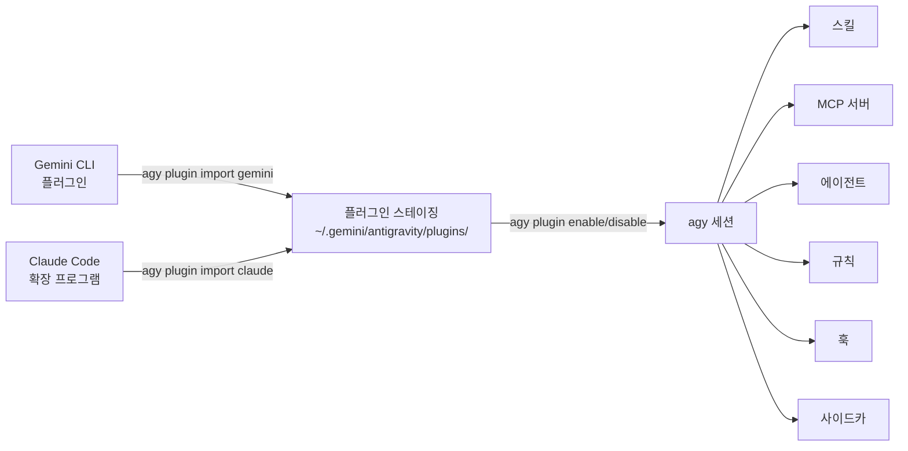

# 참조: 플러그인 생태계

> **agy-cli의 플러그인 시스템에 대한 심층 참조입니다.** 필수 명령어는 [모듈 1 — 섹션 1.7](sdlc-productivity.md#17-extend-with-plugins-15-min)에서 다룹니다. 이 페이지는 커스텀 플러그인을 구축하고 유지 관리하는 팀을 위한 전체 라이프사이클 세부 정보를 제공합니다.

---

## 2.0 — 플러그인이 중요한 이유 <span class="duration-badge">5 min</span>

agy-cli의 플러그인 시스템은 독특한 기능을 수행합니다. 재설치나 재구성 없이 **Gemini CLI 또는 Claude Code에 이미 설치한 플러그인을 가져올 수 있습니다**. 확장 프로그램에 대한 기존 투자가 그대로 이어집니다.

```bash
# See what plugins are currently active in agy
agy plugin list
```

출력은 JSON 형식이며 각 플러그인의 이름, 소스, 가져오기 날짜 및 구성 요소(스킬, 명령어, mcpServers, 에이전트)를 보여줍니다.

```bash
# More readable
agy plugin list | python3 -m json.tool
```

> 📖 공식 문서: [플러그인](https://www.antigravity.google/docs/plugins) · [MCP](https://www.antigravity.google/docs/mcp) · [스킬](https://www.antigravity.google/docs/skills)

---

## 2.1 — Gemini CLI에서 가져오기 <span class="duration-badge">10분</span>

> **패턴: Cross-Tool Plugin Bridge** — 전체 Gemini CLI 플러그인 설정을 agy로 가져옵니다.

### 모든 Gemini CLI 플러그인 가져오기

```bash
agy plugin import gemini
```

agy는 로컬 Gemini CLI 설치를 스캔하여 설치된 모든 플러그인을 검색하고, 해당 구성 요소(스킬, 명령어, MCP 서버, 에이전트)를 `~/.gemini/antigravity/`에 있는 agy의 설정으로 스테이징합니다.

출력은 다음과 같습니다:

```text
  [ok]    code-review
          ✔ skills      : 3 processed
          ✔ commands    : 2 processed
          - mcpServers  : skipped (not found)
  [ok]    gemini-deep-research
          ✔ commands    : 1 processed
          ✔ mcpServers  : 1 processed
  [skip]  superpowers (already imported)
```

!!! tip "--force를 사용하여 다시 가져오기"
    이미 가져온 플러그인은 기본적으로 건너뜁니다. 플러그인 업데이트 후 강제로 다시 가져오려면 다음을 실행하세요:
    ```bash
    agy plugin import gemini --force
    ```

### What Gets Imported

| Component | What it means |
| :-- | :-- |
| `skills` | SKILL.md files with YAML frontmatter — injected into agy's context |
| `commands` | Slash commands available inside agy sessions |
| `mcpServers` | MCP tool servers (GitHub, gcloud, Workspace, etc.) — stdio or SSE |
| `agents` | Custom subagent definitions |
| `hooks` | Staged but not auto-executed (agy handles lifecycle differently) |
| `rules` | Rules files (`rules.md`, `rules/*.md`) injected as RULE blocks |

---

## 2.2 — Importing from Claude Code <span class="duration-badge">5 min</span>

> **Pattern: Unified Tool Surface** — if you use Claude Code alongside agy, import its plugins too.

```bash
agy plugin import claude
```

Same mechanic — agy discovers your Claude Code extension installations and bridges compatible components.

!!! info "Component compatibility"
    Not all Claude Code extension components map 1:1 to agy's model. agy imports what's compatible and silently skips what isn't.

---

## 2.3 — Managing Plugins Per-Project <span class="duration-badge">10 min</span>

> **Pattern: Project-Scoped Plugin Config** — not every plugin is appropriate for every codebase.

### Enable / Disable

```bash
# 이 세션/프로젝트에 대해 플러그인 비활성화
agy plugin disable gemini-deep-research

# 다시 활성화
agy plugin enable gemini-deep-research

# 현재 상태 확인
agy plugin list
```

### Plugin Locations

Plugins can be installed at two levels:

| Scope | Path |
| :-- | :-- |
| **Global** | `~/.gemini/config/plugins/` |
| **Project** | `.agents/plugins/` |

### Install a Specific Plugin

```bash
# 이름으로 설치 (설정된 소스에서)
agy plugin install <plugin-name>

# 특정 버전 설치
agy plugin install <plugin-name>@<version>
```

---

## 2.4 — Validating a Plugin <span class="duration-badge">10 min</span>

> **Pattern: Plugin-as-Code** — treat plugin definitions like source code. Validate before shipping.

### Validate an Existing Plugin Directory

```bash
# 플러그인 디렉터리 유효성 검사
agy plugin validate ./path/to/my-plugin

# 또는 현재 디렉터리 유효성 검사
agy plugin validate .
```

This checks that the plugin's `plugin.json` manifest is well-formed and all referenced components exist.

### Build a Minimal Custom Plugin

A valid agy plugin needs a `plugin.json` manifest. Here's the official structure:

```text
my-plugin/
├── plugin.json          ← 매니페스트 (필수)
├── mcp_config.json      ← MCP 서버 정의 (선택 사항)
├── hooks.json           ← 훅 이벤트 핸들러 (선택 사항)
├── skills/              ← YAML 프런트매터가 있는 SKILL.md 파일
│   └── my-skill/
│       └── SKILL.md
├── agents/              ← 서브에이전트 정의 (선택 사항)
└── rules/               ← 규칙 파일 (선택 사항)
    └── my-rules.md
```

```json
{
  "name": "my-plugin",
  "version": "1.0.0",
  "description": "내 사용자 지정 agy 플러그인",
  "components": ["skills"]
}
```

```bash
# 유효성 검사
agy plugin validate ./my-plugin

# 유효한 경우 다음이 표시됩니다: ✔ Plugin manifest is valid
```

### Interacting with Plugin Components

Use slash commands to inspect active plugin components in a session:

| Command | What it shows |
| :-- | :-- |
| `/skills` | All loaded skills (from plugins, project, global) |
| `/mcp` | Active MCP servers and their status |

### Exercise: Validate the Workshop Plugin

The workshop repo includes a sample plugin at `samples/plugins/workshop-helpers/`. Validate it:

```bash
agy plugin validate samples/plugins/workshop-helpers/
```

---

## 2.5 — Plugin Architecture Overview



Plugin staging directory structure:

```text
~/.gemini/antigravity/plugins/<name>/
├── plugin.json
├── mcp_config.json
├── hooks.json
├── skills/
├── agents/
├── rules/
└── sidecars/          ← 플러그인 범위의 백그라운드 프로세스
```

---

## 2.6 — Sidecars: Persistent Background Processes <span class="duration-badge">15 min</span>

> **Pattern: Always-On Agent** — sidecars run alongside AGY CLI, independently of any conversation. Use them for scheduled tasks, event watchers, and persistent background workers.
>
> 📖 Source: [sidecars](https://antigravity.google/docs/sidecars)

### What Sidecars Are

A sidecar is a background process that AGY manages for you: it launches automatically when AGY starts, restarts on crash, and runs independently of your active conversation. Unlike hooks (which fire in response to conversation events), sidecars are **always running**.

**Three use cases:**

| Use case | Example |
| :-- | :-- |
| Persistent background worker | Python script that watches a queue |
| Scheduled recurring task | Hourly PR triage via `schedule` builtin |
| Event-reactive agent | `agentapi` call that spins up a new conversation |

### Configuration

Sidecars are discovered from two locations:

```bash
# 전역 사이드카 (모든 프로젝트에서 사용 가능)
~/.gemini/config/sidecars/<sidecar-name>/sidecar.json

# 플러그인 범위 사이드카 (플러그인과 함께 제공됨)
~/.gemini/config/plugins/<plugin-name>/sidecars/<sidecar-name>/sidecar.json
```

The directory name becomes the sidecar's ID. Plugin sidecars get the ID `<pluginName>/<sidecarName>`.

**Sidecars are disabled by default.** Enable them explicitly in `~/.gemini/config/config.json`:

```json
{
  "sidecars": {
    "pr-triage": {
      "enabled": true
    },
    "my-plugin/log-watcher": {
      "enabled": true,
      "projectId": "<conversation-project-id>"
    }
  }
}
```

### sidecar.json Schema

| Field | Type | Description |
| :-- | :-- | :-- |
| `command` | string | Executable to run (e.g. `python3`). Mutually exclusive with `builtin`. |
| `builtin` | string | Built-in function. Currently only `schedule`. Mutually exclusive with `command`. |
| `args` | string[] | Arguments passed to the command or builtin. |
| `restart_policy` | string | `always` (default), `on-failure`, or `never`. |
| `description` | string | Human-readable label shown in AGY UI. |
| `env` | object | Environment variables for the sidecar process. |
| `display_name` | string | Display name in the UI. |

### Example 1: Background Worker Script

```json
{
  "description": "빌드 대기열을 모니터링하고 실패 시 알림을 보냅니다.",
  "command": "python3",
  "args": ["watch_builds.py"],
  "restart_policy": "on-failure",
  "env": {
    "BUILD_QUEUE_URL": "https://ci.example.com/api/queue"
  }
}
```

### Example 2: Scheduled Recurring Task (the `schedule` builtin)

The `schedule` builtin takes a cron expression as its first arg, then the command + args to run:

```json
{
  "description": "매시간 PR 분류 — 수신된 리뷰 요청을 요약합니다.",
  "builtin": "schedule",
  "args": [
    "0 * * * *",
    "agentapi",
    "new-conversation",
    "내 리뷰를 기다리는 모든 열린 PR을 요약해 줘. 긴급도에 따라 그룹화해 줘."
  ]
}
```

`agentapi` is automatically available to sidecars — it lets them **programmatically create or message conversations**:

```bash
# 사이드카에서 새 대화 시작
agentapi new-conversation "<prompt>"

# 기존 대화에 메시지 보내기
agentapi send-message <conversation_id> "<prompt>"
```

!!! warning "projectId required for agentapi"
    Sidecars that use `agentapi new-conversation` must have a `projectId` set in `config.json` — this scopes which conversation project the new session is created under.

### Runtime Data

Sidecar output is stored at:

```text
~/.gemini/antigravity/sidecar_data/<sidecarId>/
├── data/     ← 영구 스토리지 (ANTIGRAVITY_EXECUTABLE_DATA_DIR 환경 변수)
├── logs/     ← 타임스탬프가 기록된 stdout/stderr 로그
└── events/   ← agentapi 호출의 JSON 레코드
```

### Directory Structure for a Plugin Sidecar

```text
~/.gemini/config/plugins/my-plugin/
└── sidecars/
    └── pr-triage/
        ├── sidecar.json   ← 설정 (필수)
        └── triage.py      ← 헬퍼 스크립트 (선택 사항, 이 디렉터리에서 실행됨)
```

---

## 모듈 2 연습 문제

<div class="exercise-card" markdown>

### :material-file-document: 연습 문제 2: 플러그인 브리지

**파일:** [`ex02_plugin_bridge.md`](exercises/ex02_plugin_bridge.md)
**소요 시간:** 20분
**목표:** Gemini CLI에서 플러그인을 가져오고, 선택적으로 활성화/비활성화하며, 사용자 지정 플러그인을 검증합니다.

</div>

<div class="exercise-card" markdown>

### :material-clock-outline: 연습 문제 2B: 첫 번째 사이드카

**파일:** [`ex02b_first_sidecar.md`](exercises/ex02b_first_sidecar.md)

> **소요 시간:** 20분
> **빌드:** 오전 9시에 실행되어 새로운 AGY 대화를 생성하고, 리포지토리 전체에서 어제 발생한 git 커밋을 요약하도록 요청하는 예약된 **일일 스탠드업 사이드카**를 구축합니다.

**수행할 작업:**

1. `schedule` 내장 기능을 사용하여 `~/.gemini/config/sidecars/standup/sidecar.json`을 생성합니다.
2. cron을 `0 9 * * 1-5`(월~금 오전 9시)로 설정합니다.
3. `agentapi new-conversation`을 사용하여 스탠드업 프롬프트로 대화를 엽니다.
4. `~/.gemini/config/config.json`에서 이를 활성화합니다.
5. `~/.gemini/antigravity/sidecar_data/standup/logs/`의 로그에 나타나는지 확인합니다.

**추가 목표:** `command: python3`을 사용하여 로컬 파일의 변경 사항을 감시하고, 차이점을 감지하면 기존 대화에 메시지를 보내는 두 번째 사이드카를 추가합니다.

</div>

---

## 워크숍으로 돌아가기

→ **[모듈 1: SDLC 생산성 향상](sdlc-productivity.md)** — 플러그인은 섹션 1.7에서 소개됩니다

→ **[치트시트](cheatsheet.md)** — 모든 플러그인 및 사이드카 명령어를 한곳에 모아두었습니다
