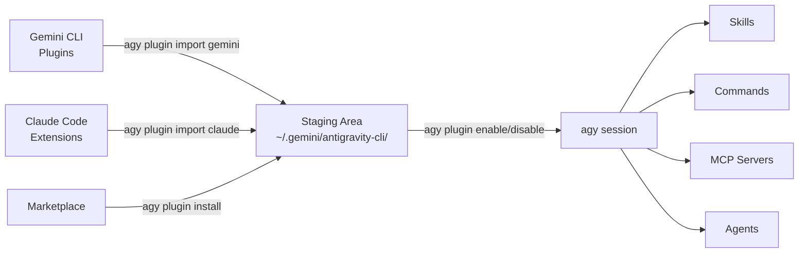

# Module 2: Plugin Ecosystem <span class="duration-badge">45 min</span>

> **agy-cli's standout feature.** No other AI coding CLI can bridge plugins from Gemini CLI and Claude Code into a single interface. This module covers the full plugin lifecycle: import, install, enable, disable, and validate.

---

## 2.0 — Why Plugins Matter <span class="duration-badge">5 min</span>

agy-cli's plugin system does something unique: it can **import plugins you've already installed in Gemini CLI or Claude Code** — without reinstalling or reconfiguring. Your existing investment in extensions carries over.

```bash
# See what plugins are currently active in agy
agy plugin list
```

The output is JSON showing each plugin's name, source, import date, and components (skills, commands, mcpServers, agents).

```bash
# More readable
agy plugin list | python3 -m json.tool
```

---

## 2.1 — Importing from Gemini CLI <span class="duration-badge">10 min</span>

> **Pattern: Cross-Tool Plugin Bridge** — pull your entire Gemini CLI plugin setup into agy.

### Import All Gemini CLI Plugins

```bash
agy plugin import gemini
```

agy scans your local Gemini CLI installation, discovers all installed plugins, and stages their components (skills, commands, MCP servers, agents) into agy's config at `~/.gemini/antigravity-cli/`.

Output looks like:
```
  [ok]    code-review
          ✔ skills      : 3 processed
          ✔ commands    : 2 processed
          - mcpServers  : skipped (not found)
  [ok]    gemini-deep-research
          ✔ commands    : 1 processed
          ✔ mcpServers  : 1 processed
  [skip]  superpowers (already imported)
```

!!! tip "Re-import with --force"
    Already imported plugins are skipped by default. To force re-import after a plugin update:
    ```bash
    agy plugin import gemini --force
    ```

### What Gets Imported

| Component | What it means |
|---|---|
| `skills` | Specialized knowledge files injected into agy's context |
| `commands` | Slash commands available inside agy sessions |
| `mcpServers` | MCP tool servers (GitHub, gcloud, Workspace, etc.) |
| `agents` | Custom subagent definitions |
| `hooks` | Staged but not executed (agy handles lifecycle differently) |

---

## 2.2 — Importing from Claude Code <span class="duration-badge">5 min</span>

> **Pattern: Unified Tool Surface** — if you use Claude Code alongside agy, import its plugins too.

```bash
agy plugin import claude
```

Same mechanic — agy discovers your Claude Code extension installations and bridges compatible components.

!!! info "Component compatibility"
    Not all Claude Code extension components map 1:1 to agy's model. agy imports what's compatible and silently skips what isn't.

---

## 2.3 — Managing Plugins Per-Project <span class="duration-badge">10 min</span>

> **Pattern: Project-Scoped Plugin Config** — not every plugin is appropriate for every codebase.

### Enable / Disable

```bash
# Disable a plugin for this session/project
agy plugin disable gemini-deep-research

# Re-enable it
agy plugin enable gemini-deep-research

# Check current state
agy plugin list
```

### Install a Specific Plugin

```bash
# Install by name (from configured marketplace)
agy plugin install <plugin-name>

# Install a specific version
agy plugin install <plugin-name>@<version>
```

<!-- TODO: marketplace URL to be confirmed post-Google I/O. Above syntax is confirmed from --help. -->

!!! warning "Marketplace Coming Soon"
    The `plugin install` command supports a marketplace registry (`plugin@marketplace` syntax). The public marketplace URL will be announced at Google I/O. For now, use `plugin import` to bring in plugins from Gemini CLI or Claude.

---

## 2.4 — Validating a Plugin <span class="duration-badge">10 min</span>

> **Pattern: Plugin-as-Code** — treat plugin definitions like source code. Validate before shipping.

### Validate an Existing Plugin Directory

```bash
# Validate a plugin directory
agy plugin validate ./path/to/my-plugin

# Or validate the current directory
agy plugin validate .
```

This checks that the plugin's `plugin.json` (or equivalent manifest) is well-formed and all referenced components exist.

### Build a Minimal Custom Plugin

A valid agy plugin needs a `plugin.json` manifest. Here's the minimal structure:

```
my-plugin/
├── plugin.json          ← manifest (required)
├── skills/              ← optional: markdown skill files
│   └── my-skill.md
└── commands/            ← optional: slash command definitions
```

```json
{
  "name": "my-plugin",
  "version": "1.0.0",
  "description": "My custom agy plugin",
  "components": ["skills"]
}
```

```bash
# Validate it
agy plugin validate ./my-plugin

# If valid, you'll see: ✔ Plugin manifest is valid
```

### Exercise: Validate the Workshop Plugin

The workshop repo includes a sample plugin at `samples/plugins/workshop-helpers/`. Validate it:

```bash
agy plugin validate samples/plugins/workshop-helpers/
```

---

## 2.5 — Plugin Architecture Overview



---

## Module 2 Exercises

<div class="exercise-card" markdown>

#### :material-file-document: Exercise 2: Plugin Bridge

**File:** `exercises/ex02_plugin_bridge.md`
**Duration:** 20 min
**Objective:** Import plugins from Gemini CLI, enable/disable selectively, validate a custom plugin.

</div>

---

## Next Module

→ **[Module 3: DevOps & Automation](devops-automation.md)** — non-interactive pipelines, CI/CD, multi-directory workspaces.
