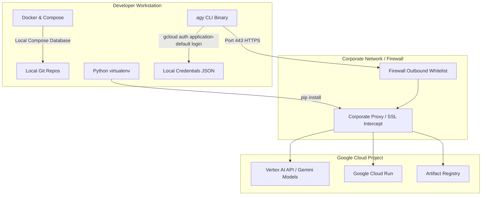

# Track B — Role 1: IT Admin Provisioning

This guide is designed for **enterprise cloud administrators**, **IT infrastructure managers**, and **workshop facilitators**. It explains how to provision Google Cloud Platform (GCP) resources and configure network parameters for the **Antigravity CLI Field Workshop** running on local corporate developer workstations.

This is **Role 1 (one-time IT Admin configuration)** under the unified **Track B: Corporate Dev Track**. For the developer-specific workstation onboarding (Python, virtualenvs, local Docker config, and credentials login), refer developers to **[Role 2: Developer Workstation Setup](setup-corporate.md)**.

---

## Onboarding Architecture



---

## Phase 1: Google Cloud Project Setup

We recommend creating a single, dedicated GCP project for the workshop, or individual sandbox projects for each attendee.

### 1.1 — Create a GCP Project

Create a new project specifically for the workshop:

```bash
gcloud projects create agy-workshop-sandbox-99 --name="Antigravity Workshop Sandbox"
```

### 1.2 — Enable Required APIs

Enable every API the workshop uses across all modules — CLI/SDK model inference (Vertex AI), containerized agent deployment (Cloud Run, Artifact Registry, Cloud Build), and the optional GCP Data Cloud lab (BigQuery, Dataplex). Enabling them centrally means attendees never need `serviceusage` permissions themselves:

```bash
gcloud services enable aiplatform.googleapis.com \
                       run.googleapis.com \
                       artifactregistry.googleapis.com \
                       cloudbuild.googleapis.com \
                       bigquery.googleapis.com \
                       dataplex.googleapis.com \
                       --project="agy-workshop-sandbox-99"
```

> [!NOTE]
> The optional Dataplex/Developer-Knowledge MCP lab (Exercise 14) additionally uses `developerknowledge.googleapis.com`. Enable it only if you plan to run that lab: `gcloud services enable developerknowledge.googleapis.com --project="agy-workshop-sandbox-99"`.

### 1.3 — Configure IAM Roles for Attendees

Grant each attendee (employee) the following minimum permissions in the workshop project. To simplify administration, we recommend adding all workshop attendees to a dedicated Google Group (e.g., `agy-workshop-attendees@yourcompany.com`) and binding the roles to the group in bulk.

| IAM Role | Role Identifier | Why it's needed |
| :-- | :-- | :-- |
| **Vertex AI User** | `roles/aiplatform.user` | Essential. Allows the `agy` CLI, the Python SDK, and `agents-cli` (ADK) to invoke Gemini models on Vertex AI. |
| **Cloud Run Admin** | `roles/run.admin` | Deploy agents to Cloud Run **and** set the invoker policy for `--allow-unauthenticated` (the plain `roles/run.developer` cannot set IAM policy, so `--allow-unauthenticated` fails with it). |
| **Cloud Build Editor** | `roles/cloudbuild.builds.editor` | `gcloud run deploy --source` / `agents-cli deploy` submit a Cloud Build job to build the container image. |
| **Artifact Registry Writer** | `roles/artifactregistry.writer` | Allows the built container images to be pushed to Artifact Registry. |
| **Storage Admin** | `roles/storage.admin` | Source-based deploys upload the build context to a Cloud Storage staging bucket, which the deploying identity must be able to create and write (read-only `objectViewer` is not enough). |
| **Service Account User** | `roles/iam.serviceAccountUser` | Allows attendees to deploy services that *run as* the runtime (default Compute Engine) service account. |

> [!NOTE]
> **Optional GCP Data Cloud lab (Exercise 14)** additionally needs `roles/bigquery.dataEditor`, `roles/bigquery.jobUser`, and `roles/dataplex.catalogEditor`. Add them to the loop below only if you are running that lab.

To assign these roles in bulk to a Google Group via `gcloud`, run the following script:

```bash
# Define project and attendee group
export PROJECT_ID="agy-workshop-sandbox-99"
export ATTENDEE_GROUP="group:agy-workshop-attendees@yourcompany.com"

# Bind each required role
for role in \
  roles/aiplatform.user \
  roles/run.admin \
  roles/cloudbuild.builds.editor \
  roles/artifactregistry.writer \
  roles/storage.admin \
  roles/iam.serviceAccountUser; do
    gcloud projects add-iam-policy-binding "$PROJECT_ID" \
      --member="$ATTENDEE_GROUP" \
      --role="$role"
done
```

### 1.4 — Grant the Runtime Service Account Vertex Access

Deployed agents run **as** the project's default Compute Engine service account, and that identity — not the attendee — makes the Vertex AI calls at runtime. Without this grant, a successfully deployed agent still returns `403` on its first model call:

```bash
PROJECT_NUMBER=$(gcloud projects describe "$PROJECT_ID" --format='value(projectNumber)')
gcloud projects add-iam-policy-binding "$PROJECT_ID" \
  --member="serviceAccount:${PROJECT_NUMBER}-compute@developer.gserviceaccount.com" \
  --role="roles/aiplatform.user"
```

Alternatively, to grant these roles to individual employees individually, run:

```bash
gcloud projects add-iam-policy-binding "agy-workshop-sandbox-99" \
    --member="user:employee.name@yourcompany.com" \
    --role="roles/aiplatform.user"
```

---

## Phase 2: Workstation Requirements (IT Admin Review)

Developers will run the workshop locally on their corporate-managed workstations. The workstation software stack is detailed in **[Pre-Work: Corporate Workstation Onboarding](setup-corporate.md)**, but as an IT Admin, ensure that:

1. **Software Policies Allow Docker Desktop / Rancher Desktop**: The workshop exercises require local Docker and Docker Compose (v2) to run isolated integration checks (e.g., modernizing a database-connected .NET/Java target). Ensure local security agents (such as Carbon Black or CrowdStrike) do not block local container executions.
2. **User Profiles Have Local Credentials Storage**: The Google Cloud SDK Application Default Credentials (ADC) are stored as JSON files. Ensure corporate backup or lockdown policies do not restrict write access to:
    - **macOS/Linux**: `~/.config/gcloud/application_default_credentials.json`
    - **Windows**: `%APPDATA%\gcloud\application_default_credentials.json`

---

## Phase 3: Enterprise Network, Firewalls, & Proxies

Corporate networks with deep packet inspection (DPI), SSL-decrypting firewalls, or strict outbound whitelists may block access to Google APIs, package managers, or installation assets.

### 3.1 — Firewall Outbound Egress Rules

Ensure outbound HTTPS (port 443) traffic is whitelisted to the following domains on the corporate network or VPN:

| Resource Group | Domain Pattern | Reason |
| :-- | :-- | :-- |
| **Vertex AI API** | `*.aiplatform.googleapis.com` (e.g. `us-central1-aiplatform.googleapis.com`) | For model calls from `agy` and python. |
| **Google Auth** | `accounts.google.com`, `oauth2.googleapis.com` | For `agy` sign-in and Application Default Credentials login. |
| **GCP Services** | `*.googleapis.com`, `*.run.app` | For API access and reaching deployed Cloud Run services. |
| **Python Packages** | `pypi.org` and `files.pythonhosted.org` | For installing dependencies inside developer virtualenvs. |
| **GitHub** | `github.com` | For cloning the curriculum and sandbox codebases. |
| **Antigravity CLI** | `antigravity.google` | For downloading and installing the `agy` binary. |

### 3.2 — Corporate SSL-Decrypting Proxies

If your enterprise proxy intercepts HTTPS traffic and decrypts SSL, Python package managers (`pip`) and CLI tools will fail with `SSL: CERTIFICATE_VERIFY_FAILED` errors.

Advise developers on how to configure Python to trust your enterprise Root Certificate Bundle. These are typically set via environment variables:

- `PIP_CERT`: Points pip to your root certificate bundle file.
- `REQUESTS_CA_BUNDLE`: Points Python's `requests` package to the bundle file.

See **[Corporate Workstation Onboarding (Step 4)](setup-corporate.md)** for developer configuration details.

---

## Phase 4: Automated Pre-Work Verification

To guarantee zero setup blocks on day-one of the workshop, have each attendee run the workstation verification script. This repo contains two robust OS-specific verifiers:

- **macOS / Linux / WSL2 (Bash)**: `scripts/verify-workstation.sh`
- **Native Windows (PowerShell)**: `scripts/verify-workstation.ps1`

Both verifiers perform the following automated checks:

1. Verifies core binaries (`git`, `python3`, `gcloud`, `agy`).
2. Tests Python version compliance and isolated `venv` creation.
3. Tests package installations against corporate firewalls or proxies.
4. Confirms that **Docker and Docker Compose are running** and the local Docker daemon is healthy.
5. Verifies local GCP Application Default Credentials (ADC) login status.
6. **Performs an actual outbound call to Vertex AI** to verify project access, API enablement, and `roles/aiplatform.user` permissions.

### Admin Handoff

Please direct all workshop attendees to follow the **[Corporate Workstation Onboarding Guide](setup-corporate.md)** and request that they send you a screenshot of their successful verification summaries prior to the workshop session!
