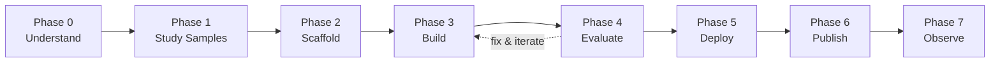

# 模块 5：使用 agents-cli 构建 ADK 代理

<div class="module-header" markdown>
**时长：** 约 75 分钟  
**目标：** 使用 `agents-cli` 搭建、构建、评估和部署生产级 ADK 代理——完全在你的 Antigravity CLI 会话中完成。  
**练习：** [练习 12：ADK 代理——搭建、评估、部署](exercises/ex12_agents_cli_lifecycle.md)
</div>

> 📖 参考资料：[agents-cli GitHub](https://github.com/google/agents-cli) · [agents-cli 文档](https://google.github.io/agents-cli/) · [ADK](https://adk.dev) · [PyPI](https://pypi.org/project/google-agents-cli/)

---

## 什么是 agents-cli？

`agents-cli` **不是**一个编码代理。它是**编码代理的工具包** —— 它为你的 Antigravity CLI 会话提供构建、评估和在 Google Cloud 上部署 [ADK](https://adk.dev)（代理开发套件）代理的技能和命令。

| | Antigravity CLI | agents-cli |
| :-- | :-- | :-- |
| **它是什么** | 交互式编码代理 | *用于*编码代理的工具包 |
| **它的作用** | 编写代码，回答问题 | 搭建、评估、部署 ADK 代理 |
| **如何使用** | 要求它做事 | 要求 agy 使用 agents-cli 做事 |
| **兼容性** | — | Antigravity CLI, Gemini CLI, Claude Code, Codex |

可以这样理解：**agy 是你的双手，agents-cli 是电动工具**。

---

## 5.1 — 环境设置 <span class="duration-badge">10 min</span>

### 先决条件

- Python 3.11+
- [uv](https://docs.astral.sh/uv/getting-started/installation/) (Python 包管理器)
- [Node.js](https://nodejs.org/) (用于技能安装)
- Google Cloud 项目或 [AI Studio API 密钥](https://aistudio.google.com/apikey)

### 安装 agents-cli

```bash
uvx google-agents-cli setup
```

这将执行三项操作：

1. 安装 `agents-cli` 二进制文件
2. 将 7 项技能安装到您的编码代理中 (Antigravity CLI、Gemini CLI、Claude Code)
3. 配置身份验证

### 验证

```bash
agents-cli info
```

!!! tip "技能是秘诀"
    在环境设置之后，agy 会自动加载 agents-cli 技能 —— 这意味着您可以说 *“搭建一个 ADK 代理”*，agy 就会确切地知道要运行哪些命令、遵循哪些模式以及避免哪些错误。

---

## 5.2 — 7 阶段生命周期 <span class="duration-badge">10 分钟</span>

agents-cli 强制执行**结构化的开发生命周期**。每个阶段都有一个专用的技能，当你的编码代理到达该阶段时就会加载它：



| 阶段 | 技能 | 具体操作 |
| :-- | :-- | :-- |
| 0 — 理解 | — | 明确目标，编写 `.agents-cli-spec.md` |
| 1 — 学习示例 | — | 克隆并学习匹配的 [adk-samples](https://github.com/google/adk-samples) |
| 2 — 搭建脚手架 | `google-agents-cli-scaffold` | `agents-cli scaffold create <name>` |
| 3 — 构建 | `google-agents-cli-adk-code` | 编写代理代码 — 工具、回调、状态 |
| 4 — 评估 | `google-agents-cli-eval` | `agents-cli eval generate` → `eval grade` → 修复 → 重复 |
| 5 — 部署 | `google-agents-cli-deploy` | `agents-cli deploy` 到 Agent Runtime / Cloud Run / GKE |
| 6 — 发布 | `google-agents-cli-publish` | 注册到 Gemini Enterprise（可选） |
| 7 — 观察 | `google-agents-cli-observability` | Cloud Trace、日志记录、监控 |

> **关键见解：** 阶段 4（评估）是最关键的。预计需要进行 **5–10 次以上**的评估-修复循环迭代。这是正常的，也是代理质量的来源。

---

## 5.3 — 搭建项目脚手架 <span class="duration-badge">10 min</span>

### 原型优先模式

始终以 `--prototype` 开始，以跳过 CI/CD 和 Terraform。先让代理运行起来，稍后再添加部署：

```bash
# Step 1: Create a prototype
agents-cli scaffold create my-agent --agent adk --prototype

# Step 2: Iterate on agent code...

# Step 3: Add deployment when ready
agents-cli scaffold enhance . --deployment-target agent_runtime
```

### 模板选项

| 模板 | 描述 |
| :-- | :-- |
| `adk` | 标准 ADK 代理（默认） |
| `adk_a2a` | 代理间协调（A2A 协议） |
| `agentic_rag` | 带有数据摄取管道的 RAG |

### 部署目标

| 目标 | 描述 |
| :-- | :-- |
| `agent_runtime` | 由 Google 托管（Gemini Enterprise Agent Runtime） |
| `cloud_run` | 基于容器，更多控制权 |
| `gke` | 在 GKE Autopilot 上的完全 Kubernetes 控制权 |

### 脚手架创建的内容

```text
my-agent/
├── app/
│   ├── __init__.py          ← App entry point (name must match directory)
│   ├── agent.py             ← Agent definition (instruction, tools, model)
│   └── tools.py             ← Custom tool functions
├── tests/
│   └── eval/
│       ├── datasets/
│       │   └── basic-dataset.json  ← Starter eval cases
│       └── eval_config.yaml        ← Metrics configuration
├── .env                     ← Environment variables (project ID, API keys)
├── agents-cli-manifest.yaml ← Project metadata (CLI reads this)
├── pyproject.toml           ← Python dependencies
├── GEMINI.md                ← Coding agent guidance file
└── Makefile                 ← Common task shortcuts
```

---

## 5.4 — 构建代理代码 <span class="duration-badge">15 min</span>

### 代理定义模式

脚手架生成的 `app/agent.py` 是你的起点：

```python
from google.adk import Agent

root_agent = Agent(
    name="my_agent",
    model="gemini-3.5-flash",
    instruction="""You are a helpful assistant that...""",
    tools=[my_tool_function],
)
```

### 工具定义

工具是普通的 Python 函数，带有类型注解的参数和文档字符串：

```python
def get_weather(city: str) -> dict:
    """Get current weather for a city.

    Args:
        city: The city name to look up weather for.

    Returns:
        A dict with temperature and conditions.
    """
    # Your implementation here
    return {"temp_f": 72, "conditions": "sunny"}
```

### 快速测试

```bash
# One-off smoke test
agents-cli run "What's the weather in Tokyo?"

# Interactive playground (web UI)
agents-cli playground
```

!!! warning "永远不要编写断言 LLM 输出的 pytest 测试"
    LLM 的输出是不确定的。使用 `agents-cli eval` 进行行为验证，而不是 pytest。仅将 pytest 用于代码正确性（导入正常工作，函数返回正确的类型）。

---

## 5.5 — 评估循环 <span class="duration-badge">20 分钟</span>

> **这是最重要的部分。** 评估是区分演示和生产级代理的关键。

### 质量飞轮

```text
┌─ 1. Prepare Data ─────── Write eval cases or synthesize them
│
├─ 2. Run Inference ────── agents-cli eval generate
│
├─ 3. Grade Traces ─────── agents-cli eval grade
│
├─ 4. Analyze Failures ──── Read results, identify root causes
│
└─ 5. Fix & Iterate ────── Fix agent code, go back to step 2
```

### 评估数据集格式

评估用例是包含提示词和可选预期行为的 JSON 文件：

```json
{
  "eval_cases": [
    {
      "eval_case_id": "greeting",
      "prompt": {
        "role": "user",
        "parts": [{"text": "Hello, what can you help me with?"}]
      }
    },
    {
      "eval_case_id": "weather_query",
      "prompt": {
        "role": "user",
        "parts": [{"text": "What's the weather in San Francisco?"}]
      }
    }
  ]
}
```

### 内置指标

| 指标 | 测量内容 |
| :-- | :-- |
| `multi_turn_task_success` | 代理是否完成了用户的目标？ |
| `multi_turn_trajectory_quality` | 推理路径是否符合逻辑且高效？ |
| `multi_turn_tool_use_quality` | 工具/函数调用的质量 |
| `final_response_quality` | 最终响应质量（无需真实参考值） |
| `hallucination` | 事实依据 — 捕获捏造的声明 |
| `safety` | 安全策略合规性 |

### 运行评估

```bash
# One command: generate traces + grade them
agents-cli eval run

# Or two-step for more control
agents-cli eval generate
agents-cli eval grade

# Compare before/after a fix
agents-cli eval compare baseline.json candidate.json
```

### 当分数不佳时

| 失败情况 | 修复内容 |
| :-- | :-- |
| `task_success` 分数低 | 编排、遗漏的工具调用、过早终止 |
| `trajectory_quality` 分数低 | 计划提示词、指令顺序、冗余的工具调用 |
| `tool_use_quality` 分数低 | 工具描述、参数文档字符串、代理指令 |
| `hallucination` 分数低 | 严格限制指令以确保基于工具输出 |
| 代理调用了错误的工具 | 完善工具描述和代理指令 |

### 自定义指标

当内置指标无法覆盖您的领域时，请在 `eval_config.yaml` 中定义自定义指标：

```yaml
metrics_to_run:
  - multi_turn_task_success
  - response_politeness    # custom metric below

custom_metrics:
  - name: response_politeness
    prompt_template: |
      Rate the agent's response 1-5 for professional politeness.
      Prompt: {prompt}
      Response: {response}
      Return JSON: {"score": <1|2|3|4|5>, "explanation": "<reason>"}
```

---

## 5.6 — 部署 <span class="duration-badge">10 分钟</span>

一旦评估通过，添加部署并发布：

```bash
# Add deployment support (if prototype)
agents-cli scaffold enhance . --deployment-target agent_runtime

# Deploy
agents-cli deploy
```

### 添加 CI/CD

```bash
# GitHub Actions
agents-cli scaffold enhance . --cicd-runner github_actions

# Google Cloud Build
agents-cli scaffold enhance . --cicd-runner google_cloud_build
```

### 部署目标决策矩阵

| 需求 | 选择 |
| :-- | :-- |
| 最快路径，托管基础设施 | `agent_runtime` |
| 自定义容器，完全控制 | `cloud_run` |
| Kubernetes 原生，团队已在使用 GKE | `gke` |

---

## 5.7 — 在 Antigravity CLI 中使用 agents-cli <span class="duration-badge">5 分钟</span>

真正的强大之处在于将 agy 和 agents-cli 结合使用。在一次 Antigravity CLI 会话中：

```text
> Use agents-cli to scaffold an ADK agent called "expense-tracker"
  that processes receipts and categorizes expenses.
  Start with a prototype.
```

agy 将会：

1. 加载 `google-agents-cli-workflow` 技能
2. 向您询问澄清问题（阶段 0）
3. 检查匹配的 adk-samples（阶段 1）
4. 运行 `agents-cli scaffold create expense-tracker --agent adk --prototype`
5. 使用 ADK 模式实现代理代码（阶段 3）
6. 设置评估用例并运行它们（阶段 4）
7. 迭代直到通过质量阈值

您负责引导高层意图；agents-cli 技能负责处理实现细节。

---

## 技能参考

由 `agents-cli setup` 安装的 7 个技能：

| 技能 | 斜杠命令 | agy 学习的内容 |
| :-- | :-- | :-- |
| `google-agents-cli-workflow` | `/google-agents-cli-workflow` | 完整生命周期、代码保留规则、模型选择 |
| `google-agents-cli-adk-code` | `/google-agents-cli-adk-code` | ADK Python API — 代理、工具、编排、回调、状态 |
| `google-agents-cli-scaffold` | `/google-agents-cli-scaffold` | 项目脚手架 — `create`、`enhance`、`upgrade` |
| `google-agents-cli-eval` | `/google-agents-cli-eval` | 评估方法 — 指标、数据集、LLM 作为裁判 |
| `google-agents-cli-deploy` | `/google-agents-cli-deploy` | 部署 — 代理运行时、Cloud Run、GKE、CI/CD |
| `google-agents-cli-publish` | `/google-agents-cli-publish` | Gemini 企业级注册 |
| `google-agents-cli-observability` | `/google-agents-cli-observability` | Cloud Trace、日志记录、第三方集成 |

---

## 练习

<div class="exercise-card" markdown>

### :material-file-document: 练习 12：ADK 代理生命周期

**文件：** [`ex12_agents_cli_lifecycle.md`](exercises/ex12_agents_cli_lifecycle.md)
**时长：** 45 分钟
**目标：** 使用 agents-cli 工作流搭建、构建、评估和迭代 ADK 代理 —— 从 `scaffold create` 到通过评估。

</div>

---

> **下一步：** [模块 4 — 多代理与高级模式](multi-agent-advanced.md)，用于编排多个代理、子代理模式以及 `/btw` 调度系统。
