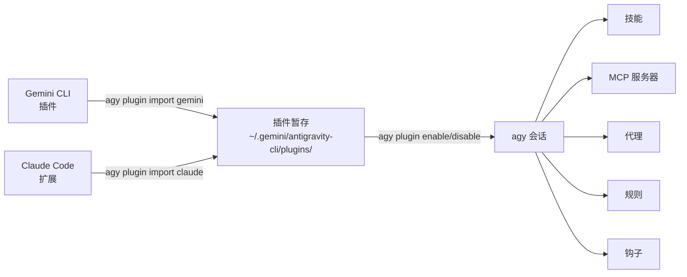

# 模块 2：插件生态系统 <span class="duration-badge">45 分钟</span>

> **agy-cli 的突出特性。** 没有任何其他 AI 编码 CLI 能够将来自 Gemini CLI 和 Claude Code 的插件桥接到一个统一的界面中。本模块涵盖完整的插件生命周期：导入、安装、启用、禁用和验证。

---
## 2.0 — 为什么插件很重要 <span class="duration-badge">5 min</span>

agy-cli 的插件系统有一个独特之处：它可以**导入你已经在 Gemini CLI 或 Claude Code 中安装的插件**——无需重新安装或重新配置。你现有的扩展投资可以无缝继承。

```bash
# See what plugins are currently active in agy
agy plugin list
```

输出结果是 JSON 格式，显示每个插件的名称、来源、导入日期和组件（技能、命令、mcpServers、代理）。

```bash
# More readable
agy plugin list | python3 -m json.tool
```

> 📖 官方文档：[插件](https://www.antigravity.google/docs/plugins) · [MCP](https://www.antigravity.google/docs/mcp) · [技能](https://www.antigravity.google/docs/skills)

---
## 2.1 — 从 Gemini CLI 导入 <span class="duration-badge">10 分钟</span>

> **模式：跨工具插件桥接** — 将您完整的 Gemini CLI 插件环境设置引入 agy。

### 导入所有 Gemini CLI 插件

```bash
agy plugin import gemini
```

agy 会扫描您本地的 Gemini CLI 安装，发现所有已安装的插件，并将其组件（技能、命令、MCP 服务器、代理）暂存到位于 `~/.gemini/antigravity-cli/` 的 agy 配置中。

输出如下所示：
```
  [ok]    code-review
          ✔ skills      : 3 processed
          ✔ commands    : 2 processed
          - mcpServers  : skipped (not found)
  [ok]    gemini-deep-research
          ✔ commands    : 1 processed
          ✔ mcpServers  : 1 processed
  [skip]  superpowers (already imported)
```

!!! tip "使用 --force 重新导入"
    默认情况下会跳过已导入的插件。要在插件更新后强制重新导入：
    ```bash
    agy plugin import gemini --force
    ```

### What Gets Imported

| Component | What it means |
|---|---|
| `skills` | SKILL.md files with YAML frontmatter — injected into agy's context |
| `commands` | Slash commands available inside agy sessions |
| `mcpServers` | MCP tool servers (GitHub, gcloud, Workspace, etc.) — stdio or SSE |
| `agents` | Custom subagent definitions |
| `hooks` | Staged but not auto-executed (agy handles lifecycle differently) |
| `rules` | Rules files (`rules.md`, `rules/*.md`) injected as RULE blocks |

---

## 2.2 — Importing from Claude Code <span class="duration-badge">5 min</span>

> **Pattern: Unified Tool Surface** — if you use Claude Code alongside agy, import its plugins too.

```bash
agy plugin import claude
```

Same mechanic — agy discovers your Claude Code extension installations and bridges compatible components.

!!! info "Component compatibility"
    Not all Claude Code extension components map 1:1 to agy's model. agy imports what's compatible and silently skips what isn't.

---

## 2.3 — Managing Plugins Per-Project <span class="duration-badge">10 min</span>

> **Pattern: Project-Scoped Plugin Config** — not every plugin is appropriate for every codebase.

### Enable / Disable

```bash
# 禁用此会话/项目的插件
agy plugin disable gemini-deep-research

# 重新启用它
agy plugin enable gemini-deep-research

# 检查当前状态
agy plugin list
```

### Plugin Locations

Plugins can be installed at two levels:

| Scope | Path |
|---|---|
| **Global** | `~/.gemini/config/plugins/` |
| **Project** | `.agents/plugins/` |

### Install a Specific Plugin

```bash
# 按名称安装（从配置的源）
agy plugin install <plugin-name>

# 安装特定版本
agy plugin install <plugin-name>@<version>
```

---

## 2.4 — Validating a Plugin <span class="duration-badge">10 min</span>

> **Pattern: Plugin-as-Code** — treat plugin definitions like source code. Validate before shipping.

### Validate an Existing Plugin Directory

```bash
# 验证插件目录
agy plugin validate ./path/to/my-plugin

# 或验证当前目录
agy plugin validate .
```

This checks that the plugin's `plugin.json` manifest is well-formed and all referenced components exist.

### Build a Minimal Custom Plugin

A valid agy plugin needs a `plugin.json` manifest. Here's the official structure:

```
my-plugin/
├── plugin.json          ← 清单文件（必需）
├── mcp_config.json      ← MCP 服务器定义（可选）
├── hooks.json           ← 钩子事件处理程序（可选）
├── skills/              ← 带有 YAML 前言的 SKILL.md 文件
│   └── my-skill/
│       └── SKILL.md
├── agents/              ← 子代理定义（可选）
└── rules/               ← 规则文件（可选）
    └── my-rules.md
```

```json
{
  "name": "my-plugin",
  "version": "1.0.0",
  "description": "我的自定义 agy 插件",
  "components": ["skills"]
}
```

```bash
# 验证它
agy plugin validate ./my-plugin

# 如果有效，您将看到：✔ Plugin manifest is valid
```

### Interacting with Plugin Components

Use slash commands to inspect active plugin components in a session:

| Command | What it shows |
|---|---|
| `/skills` | All loaded skills (from plugins, project, global) |
| `/mcp` | Active MCP servers and their status |

### Exercise: Validate the Workshop Plugin

The workshop repo includes a sample plugin at `samples/plugins/workshop-helpers/`. Validate it:

```bash
agy plugin validate samples/plugins/workshop-helpers/
```

---

## 2.5 — Plugin Architecture Overview



Plugin staging directory structure:

```
~/.gemini/antigravity-cli/plugins/<name>/
├── plugin.json
├── mcp_config.json
├── hooks.json
├── skills/
├── agents/
└── rules/
```

---
## 模块 2 练习

<div class="exercise-card" markdown>

#### :material-file-document: 练习 2：插件桥接

**文件：** `exercises/ex02_plugin_bridge.md`
**时长：** 20 分钟
**目标：** 从 Gemini CLI 导入插件，选择性地启用/禁用，验证自定义插件。

</div>

---
## 下一模块

→ **[模块 3：DevOps 与自动化](../devops-automation.md)** — 非交互式流水线、CI/CD、多目录工作区。
