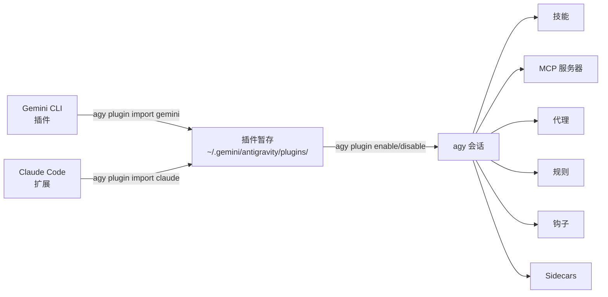

# 参考：插件生态系统

> **关于 agy-cli 插件系统的深度参考。** 基本命令已在 [模块 1 — 第 1.7 节](sdlc-productivity.md#17-extend-with-plugins-15-min) 中介绍。本页面为构建和维护自定义插件的团队提供了完整的生命周期详细信息。

---

## 2.0 — 为什么插件很重要 <span class="duration-badge">5 min</span>

agy-cli 的插件系统有一个独特之处：它可以**导入你已经在 Gemini CLI 或 Claude Code 中安装的插件**——无需重新安装或重新配置。你现有的扩展投资可以无缝延续。

```bash
# See what plugins are currently active in agy
agy plugin list
```

输出结果为 JSON 格式，显示每个插件的名称、来源、导入日期和组件（技能、命令、MCP 服务器、代理）。

```bash
# More readable
agy plugin list | python3 -m json.tool
```

> 📖 官方文档：[插件](https://www.antigravity.google/docs/plugins) · [MCP](https://www.antigravity.google/docs/mcp) · [技能](https://www.antigravity.google/docs/skills)

---

## 2.1 — 从 Gemini CLI 导入 <span class="duration-badge">10 分钟</span>

> **模式：跨工具插件桥接** — 将你完整的 Gemini CLI 插件环境设置拉取到 agy 中。

### 导入所有 Gemini CLI 插件

```bash
agy plugin import gemini
```

agy 会扫描你本地的 Gemini CLI 安装，发现所有已安装的插件，并将它们的组件（技能、命令、MCP 服务器、代理）暂存到位于 `~/.gemini/antigravity/` 的 agy 配置中。

输出如下所示：

```text
  [ok]    code-review
          ✔ skills      : 3 processed
          ✔ commands    : 2 processed
          - mcpServers  : skipped (not found)
  [ok]    gemini-deep-research
          ✔ commands    : 1 processed
          ✔ mcpServers  : 1 processed
  [skip]  superpowers (already imported)
```

!!! tip "使用 --force 重新导入"
    默认情况下会跳过已导入的插件。要在插件更新后强制重新导入：
    ```bash
    agy plugin import gemini --force
    ```

### What Gets Imported

| Component | What it means |
| :-- | :-- |
| `skills` | SKILL.md files with YAML frontmatter — injected into agy's context |
| `commands` | Slash commands available inside agy sessions |
| `mcpServers` | MCP tool servers (GitHub, gcloud, Workspace, etc.) — stdio or SSE |
| `agents` | Custom subagent definitions |
| `hooks` | Staged but not auto-executed (agy handles lifecycle differently) |
| `rules` | Rules files (`rules.md`, `rules/*.md`) injected as RULE blocks |

---

## 2.2 — Importing from Claude Code <span class="duration-badge">5 min</span>

> **Pattern: Unified Tool Surface** — if you use Claude Code alongside agy, import its plugins too.

```bash
agy plugin import claude
```

Same mechanic — agy discovers your Claude Code extension installations and bridges compatible components.

!!! info "Component compatibility"
    Not all Claude Code extension components map 1:1 to agy's model. agy imports what's compatible and silently skips what isn't.

---

## 2.3 — Managing Plugins Per-Project <span class="duration-badge">10 min</span>

> **Pattern: Project-Scoped Plugin Config** — not every plugin is appropriate for every codebase.

### Enable / Disable

```bash
# 在此会话/项目中禁用插件
agy plugin disable gemini-deep-research

# 重新启用它
agy plugin enable gemini-deep-research

# 检查当前状态
agy plugin list
```

### Plugin Locations

Plugins can be installed at two levels:

| Scope | Path |
| :-- | :-- |
| **Global** | `~/.gemini/config/plugins/` |
| **Project** | `.agents/plugins/` |

### Install a Specific Plugin

```bash
# 按名称安装（从配置的源）
agy plugin install <plugin-name>

# 安装特定版本
agy plugin install <plugin-name>@<version>
```

---

## 2.4 — Validating a Plugin <span class="duration-badge">10 min</span>

> **Pattern: Plugin-as-Code** — treat plugin definitions like source code. Validate before shipping.

### Validate an Existing Plugin Directory

```bash
# 验证插件目录
agy plugin validate ./path/to/my-plugin

# 或验证当前目录
agy plugin validate .
```

This checks that the plugin's `plugin.json` manifest is well-formed and all referenced components exist.

### Build a Minimal Custom Plugin

A valid agy plugin needs a `plugin.json` manifest. Here's the official structure:

```text
my-plugin/
├── plugin.json          ← 清单（必需）
├── mcp_config.json      ← MCP 服务器定义（可选）
├── hooks.json           ← 钩子事件处理程序（可选）
├── skills/              ← 带有 YAML 前言的 SKILL.md 文件
│   └── my-skill/
│       └── SKILL.md
├── agents/              ← 子代理定义（可选）
└── rules/               ← 规则文件（可选）
    └── my-rules.md
```

```json
{
  "name": "my-plugin",
  "version": "1.0.0",
  "description": "我的自定义 agy 插件",
  "components": ["skills"]
}
```

```bash
# 验证它
agy plugin validate ./my-plugin

# 如果有效，你将看到：✔ Plugin manifest is valid
```

### Interacting with Plugin Components

Use slash commands to inspect active plugin components in a session:

| Command | What it shows |
| :-- | :-- |
| `/skills` | All loaded skills (from plugins, project, global) |
| `/mcp` | Active MCP servers and their status |

### Exercise: Validate the Workshop Plugin

The workshop repo includes a sample plugin at `samples/plugins/workshop-helpers/`. Validate it:

```bash
agy plugin validate samples/plugins/workshop-helpers/
```

---

## 2.5 — Plugin Architecture Overview



Plugin staging directory structure:

```text
~/.gemini/antigravity/plugins/<name>/
├── plugin.json
├── mcp_config.json
├── hooks.json
├── skills/
├── agents/
├── rules/
└── sidecars/          ← 插件作用域的后台进程
```

---

## 2.6 — Sidecars: Persistent Background Processes <span class="duration-badge">15 min</span>

> **Pattern: Always-On Agent** — sidecars run alongside AGY CLI, independently of any conversation. Use them for scheduled tasks, event watchers, and persistent background workers.
>
> 📖 Source: [sidecars](https://antigravity.google/docs/sidecars)

### What Sidecars Are

A sidecar is a background process that AGY manages for you: it launches automatically when AGY starts, restarts on crash, and runs independently of your active conversation. Unlike hooks (which fire in response to conversation events), sidecars are **always running**.

**Three use cases:**

| Use case | Example |
| :-- | :-- |
| Persistent background worker | Python script that watches a queue |
| Scheduled recurring task | Hourly PR triage via `schedule` builtin |
| Event-reactive agent | `agentapi` call that spins up a new conversation |

### Configuration

Sidecars are discovered from two locations:

```bash
# 全局 sidecars（在所有项目中可用）
~/.gemini/config/sidecars/<sidecar-name>/sidecar.json

# 插件作用域的 sidecars（随插件提供）
~/.gemini/config/plugins/<plugin-name>/sidecars/<sidecar-name>/sidecar.json
```

The directory name becomes the sidecar's ID. Plugin sidecars get the ID `<pluginName>/<sidecarName>`.

**Sidecars are disabled by default.** Enable them explicitly in `~/.gemini/config/config.json`:

```json
{
  "sidecars": {
    "pr-triage": {
      "enabled": true
    },
    "my-plugin/log-watcher": {
      "enabled": true,
      "projectId": "<conversation-project-id>"
    }
  }
}
```

### sidecar.json Schema

| Field | Type | Description |
| :-- | :-- | :-- |
| `command` | string | Executable to run (e.g. `python3`). Mutually exclusive with `builtin`. |
| `builtin` | string | Built-in function. Currently only `schedule`. Mutually exclusive with `command`. |
| `args` | string[] | Arguments passed to the command or builtin. |
| `restart_policy` | string | `always` (default), `on-failure`, or `never`. |
| `description` | string | Human-readable label shown in AGY UI. |
| `env` | object | Environment variables for the sidecar process. |
| `display_name` | string | Display name in the UI. |

### Example 1: Background Worker Script

```json
{
  "description": "监视构建队列并在失败时发出通知",
  "command": "python3",
  "args": ["watch_builds.py"],
  "restart_policy": "on-failure",
  "env": {
    "BUILD_QUEUE_URL": "https://ci.example.com/api/queue"
  }
}
```

### Example 2: Scheduled Recurring Task (the `schedule` builtin)

The `schedule` builtin takes a cron expression as its first arg, then the command + args to run:

```json
{
  "description": "每小时 PR 分类 — 总结传入的审查请求",
  "builtin": "schedule",
  "args": [
    "0 * * * *",
    "agentapi",
    "new-conversation",
    "总结所有等待我审查的未决 PR。按紧急程度分组。"
  ]
}
```

`agentapi` is automatically available to sidecars — it lets them **programmatically create or message conversations**:

```bash
# 从 sidecar 启动新会话
agentapi new-conversation "<prompt>"

# 向现有会话发送消息
agentapi send-message <conversation_id> "<prompt>"
```

!!! warning "projectId required for agentapi"
    Sidecars that use `agentapi new-conversation` must have a `projectId` set in `config.json` — this scopes which conversation project the new session is created under.

### Runtime Data

Sidecar output is stored at:

```text
~/.gemini/antigravity/sidecar_data/<sidecarId>/
├── data/     ← 持久化存储（ANTIGRAVITY_EXECUTABLE_DATA_DIR 环境变量）
├── logs/     ← 带时间戳的 stdout/stderr 日志
└── events/   ← agentapi 调用的 JSON 记录
```

### Directory Structure for a Plugin Sidecar

```text
~/.gemini/config/plugins/my-plugin/
└── sidecars/
    └── pr-triage/
        ├── sidecar.json   ← 配置（必需）
        └── triage.py      ← 辅助脚本（可选，在此目录中运行）
```

---

## 模块 2 练习

<div class="exercise-card" markdown>

### :material-file-document: 练习 2：插件桥接

**文件：** [`ex02_plugin_bridge.md`](exercises/ex02_plugin_bridge.md)
**时长：** 20 分钟
**目标：** 从 Gemini CLI 导入插件，选择性地启用/禁用，验证自定义插件。

</div>

<div class="exercise-card" markdown>

### :material-clock-outline: 练习 2B：你的第一个 Sidecar

**文件：** [`ex02b_first_sidecar.md`](exercises/ex02b_first_sidecar.md)

> **时长：** 20 分钟
> **构建：** 一个定时的**每日站会 Sidecar**，在上午 9 点触发，创建一个新的 agy 对话，并要求它总结昨天在你所有仓库中的 git 提交。

**你将要做什么：**

1. 使用 `schedule` 内置功能创建 `~/.gemini/config/sidecars/standup/sidecar.json`
2. 将 cron 设置为 `0 9 * * 1-5`（周一至周五上午 9 点）
3. 使用 `agentapi new-conversation` 打开一个带有你的站会提示词的对话
4. 在 `~/.gemini/config/config.json` 中启用它
5. 验证它是否出现在 `~/.gemini/antigravity/sidecar_data/standup/logs/` 的日志中

**延伸目标：** 使用 `command: python3` 添加第二个 Sidecar，它会监视本地文件的更改，并在检测到差异时向现有对话发送消息。

</div>

---

## 返回工作坊

→ **[模块 1：SDLC 生产力提升](sdlc-productivity.md)** — 插件在 1.7 节中介绍

→ **[速查表](cheatsheet.md)** — 所有插件和 sidecar 命令集中于此
